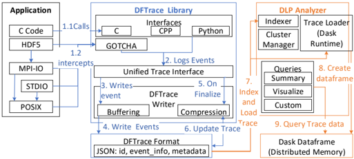
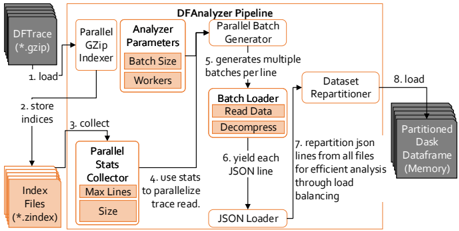
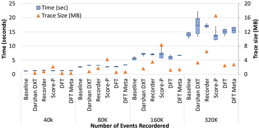
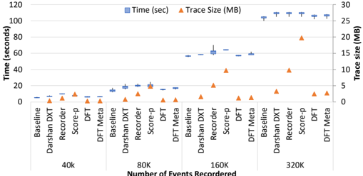
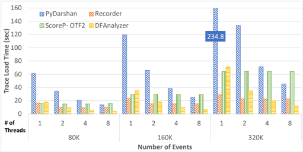
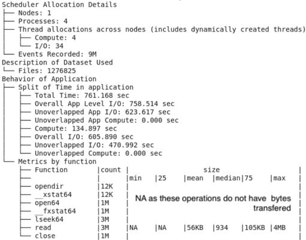
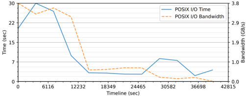

<!-- image -->

## DFTracer: An Analysis-Friendly Data Flow Tracer for AI-Driven Workflows

Hariharan Devarajan 1 , Lo¨ ıc Pottier 1 , Kaushik Velusamy 2 , Huihuo Zheng 2 , Izzet Yildirim 3 , Olga Kogiou 4 , Weikuan Yu 4 , Anthony Kougkas 3 , Xian-He Sun 3 , Jae Seung Yeom 1 , and Kathryn Mohror 1

hariharandev1@llnl.gov, pottier1@llnl.gov, kaushik.v@anl.gov, huihuo.zheng@anl.gov, iyildirim@hawk.iit.edu ok22b@fsu.edu, yuw@cs.fsu.edu, akougkas@iit.edu, sun@iit.edu, yeom2@llnl.gov, and kathryn@llnl.gov 1 Lawrence Livermore National Laboratory 2 Argonne National Laboratory 3 Illinois Institute of Technology 4 Florida State University

## Abstract

Modern HPC workflows involve intricate coupling of simulation, data analytics, and artificial intelligence (AI) applications to improve time to scientific insight. These workflows require a cohesive set of performance analysis tools to provide a comprehensive understanding of data exchange patterns in HPC systems. However, current tools are not designed to work with an AI-based I/O software stack that requires tracing at multiple levels of the application. To this end, we developed a data flow tracer called DFTracer to capture data-centric events from workflows and the I/O stack to build a detailed understanding of the data exchange within AI-driven workflows. DFTracer has the following three novel features, including a unified interface to capture trace data from different layers in the software stack, a trace format that is analysis-friendly and optimized to support efficiently loading multi-million events in a few seconds, and the capability to tag events with workflow-specific context to perform domain-centric data flow analysis for workflows. Additionally, we demonstrate that DFTracer has a 1.44x smaller runtime overhead and 1.3-7.1x smaller trace size than state-of-the-art tracing tools such as Score-P, Recorder, and Darshan. Moreover, with AI-driven workflows, Score-P, Recorder, and Darshan cannot find I/O accesses from dynamically spawned processes, and their load performance of 100M events is three orders of magnitude slower than DFTracer. In conclusion, we demonstrate that DFTracer can capture multi-level performance data, including contextual event tagging with a low overhead of 1-5% from AI-driven workflows such as MuMMI and Microsoft's Megatron Deepspeed running on large-scale HPC systems.

## Index Terms

deep learning, workflows, I/O, tracer, multilevel, application apis, system calls, transparent, interception.

## I. INTRODUCTION

Modern HPC workloads consist of various applications such as simulations, data analytics, and artificial intelligence (AI) that exchange large amounts of data for solving scientific problems on large-scale HPC systems [[1]](#ref-1). These workloads utilize AI techniques to automate data analytics, steer simulation convergence, provide smart sampling of large problem spaces, and increase the performance of inner-loop modeling of scientific workflows [[2]](#ref-2), [[3]](#ref-3), [[4]](#ref-4), [[5]](#ref-5), [[6]](#ref-6), [[7]](#ref-7). These AI-driven workflows depend on large multi-terabyte datasets and complex data exchanges between various applications to achieve their goals. The data exchange can incur a significant performance bottleneck and thus we need performance analysis tools to capture data flow between applications and various storage subsystems in modern HPC systems [[8]](#ref-8), [[9]](#ref-9).

SC24, November 17-22, 2024, Atlanta, Georgia, USA 979-8-3503-5291-7/24/ 31 . 00 © 2024 IEEE

Many existing application performance analysis tools within HPC ecosystems can be used to extract I/O performance information and provide insight about the data exchanges in these large-scale HPC workflows. These I/O tools can be classified into two categories based on the level at which they collect events: application-code and system-call level tools. The application-code level tools depend on compile time flags or developer annotations to capture the performance of functions during execution [[10]](#ref-10), [[11]](#ref-11). On the other hand, system-call level tools intercept I/O calls inside the application and log information about the I/O call characteristics [[12]](#ref-12), [[13]](#ref-13). These tools are widely used in the community to capture the behavior of workloads.

Although many performance analysis tools are available, AI-driven workflows have three unique features that make utilizing these tools challenging for scientists. First, these workflows have a complex interplay between computation and data flow tasks, which means we have to use both applicationcode and system-call level tools together to understand the behavior of the workflows. It is challenging to merge and analyze performance data from multiple tools, largely because tools utilize different resolutions for time measurement, creating an incompatible timeline of events between different performance tools [[8]](#ref-8), [[14]](#ref-14), [[15]](#ref-15), [[16]](#ref-16). Second, AI-driven workflows contain billions of events that need to be analyzed using out-ofcore distributed analysis tools [[17]](#ref-17), [[18]](#ref-18), [[19]](#ref-19). HPC tools utilize binary formats because they prioritize minimizing the overhead of instrumentation over ease of exploratory analysis using Python frameworks. Also, converting this binary data into a form compatible with popular Python-based analysis frameworks is extremely time-consuming, and it doubles the space requirements [[20]](#ref-20), [[7]](#ref-7). Finally, the events within AIdriven workflows require additional contextual information to enable domain-centric analysis. For instance, workflows often execute in stages that comprise one or more applications. In these cases, we can map stage information with individual events that can allow analysis tools [[21]](#ref-21) to group and optimize workflow stages. Another example involves AI workloads where each data read contains application context such as training step, image dimensions, logical worker index, and epoch number [[8]](#ref-8), which can help identify inefficiencies in the

<!-- image -->

input pipeline's performance. Existing application-code level tracers cannot store workflow-level context and events to assist in domain-centric analysis of the workflow's performance. These challenges dictate the need for an I/O tracer optimized to capture and analyze events from AI-driven workflows.

This work presents a data flow tracer, called DFTracer [[22]](#ref-22), that captures events from both the application-code and system-call levels for AI-driven workflows. DFTracer utilizes a unified tracing interface, a portable trace format, and dynamic metadata tagging to collect multi-level events for workflows. The unified tracing interface is written in C++ for low-overhead tracing with wrappers to C and Python. The tracer uses an indexed GZip [[23]](#ref-23) compression technique over our JSON lines-based trace format, significantly reducing space requirements and enabling efficient reading for distributed analysis. Moreover, DFTracer's unified interface supports metadata tagging for events, allowing the application or middleware software to dynamically store additional contextual information for every event. This additional contextual information allows analysis tools to perform domain-specific performance analysis that other tools cannot support. Results demonstrate that our compressed trace format is smaller and faster than state-of-the-art tracing tools. Finally, we showcase our DFAnalyzer, which builds a parallel loading pipeline to efficiently read the events from DFTracer files to enable distributed analysis for large-scale AI-driven workflows. The key contributions of this work are:

1. Design of DFTracer for capturing both application-code and system-call level events simultaneously from AI-driven workflows;
2. Building of a novel trace format that optimizes for lowoverhead capture and uses compression for space reduction and custom indices for efficient analysis; and
3. Development of DFAnalyzer to demonstrate an efficient pipeline to load DFTracer files and enable distributed I/O analysis for AI-driven workloads.

## II. BACKGROUND AND RELATED WORK

Traditionally, I/O in HPC applications are often bulksynchronous in nature. Therefore, I/O and compute are measured and analyzed separately by the scientists. Within the HPC tool ecosystem, there are many tools that capture application behaviors. The tools most related to the work in this paper are application-code and system-call tracers.

The application code tracers add annotations within the application to track the runtime performance of functions, class' methods, and processes within the application. The traces from these tools are used for application-specific cross-cutting analysis, which aims to capture the performance of the critical path of the applications. Different tracers can be used to capture events depending on the application's language, such as PerfFlowAspect [[11]](#ref-11) for Python applications and Caliper [[10]](#ref-10) for C/C++ applications. On the other end of the spectrum, some tracers use introspection techniques to collect detailed execution traces for exploratory analysis of HPC applications, such as Score-P [[24]](#ref-24), TAU [[25]](#ref-25), HPCToolkit [[26]](#ref-26), and

Recorder [[13]](#ref-13). These tracers have proven to assist performance engineers in finding inefficiency in large-scale applications and improving performance. Except for Recorder, all tracers in this list are primarily concerned with computation-based tracing. Recorder is an I/O tracing tool that captures I/O system calls and C/C++ function calls by using the functiontracing mechanism as provided by GCC and Cuda.

In the space of system call tracers for I/O, the two popular tracers in the HPC ecosystem are Darshan DXT [[12]](#ref-12) and Recorder [[13]](#ref-13). These tracers capture POSIX and STDIO calls from the applications. Darshan is a profiler that captures aggregated performance counters that can provide a highlevel understanding of HPC applications [[12]](#ref-12). Additionally, Darshan has a DXT module [[27]](#ref-27) that traces individual I/O calls from read and write APIs from the POSIX interface. Darshan's DXT tracer is being used by I/O analysis tools such as DXT-Explorer [[28]](#ref-28) and Dristhi [[29]](#ref-29) to demonstrate the access pattern of the application. On the other hand, Recorder captures all I/O calls from all layers of the I/O stack along with application function calls, MPI [[30]](#ref-30), and CUDA [[31]](#ref-31) events from the workload. Recorder has been used to analyze workflows [[7]](#ref-7) such as Montage and 1000 Genomes. Both these tracers use dynamic linking at compile time or LD PRELOAD to capture all application I/O calls with a special focus on MPI-based parallel applications with good support for non-MPI based workloads.

## III. MOTIVATION

Current application-level tracers present challenges that motivated us to develop DFTracer. First, the LD PRELOAD mechanism has limitations in capturing processes spawned from a parent process, which is common in most AI-based workloads [[8]](#ref-8), [[7]](#ref-7). For instance, PyTorch [[32]](#ref-32) and DALI [[31]](#ref-31) data loaders use process spawning that creates a new worker process outside the scope of the original application to execute I/O calls. In these cases, the worker processes are not instrumented via LD PRELOAD, which results in missing tracing output for I/O calls. For this, DFTracer has a Python binding that forces the Python to load our tracer even on the forked and spawned processes. Second, scientists have tried to combine multiple traces from the application-code and system-call level tools to create a coherent profile of the application performance [[8]](#ref-8), [[7]](#ref-7), [[14]](#ref-14), [[15]](#ref-15), [[16]](#ref-16). However, combining trace data from different tracers is a non-trivial task as we need to parse multiple types of traces and resolve timing resolution issues among these tracers to build a correct timeline of events. Additionally, with the exception of PerfFlowAspect and Caliper, all the tools mentioned above utilize a binary format to store the trace data, which makes reading them in Python extremely expensive [[20]](#ref-20), [[7]](#ref-7). Finally, as mentioned before, AI-driven workflows require contextual information on events to analyze I/O bottlenecks. This feature is not present or is limited at best in all current tracers. DFTracer captures events from application code and system calls with dynamic contextual metadata into a single log format that is interoperable and compatible with many C/C++ and Python analysis frameworks.

Table I: Capturing Unet3D with different traces

|                                                  | Score-P                                          | Darshan DXT                                      | Recorder                                         | DFTracer   |
|--------------------------------------------------|--------------------------------------------------|--------------------------------------------------|--------------------------------------------------|------------|
| # Events Captured                                | 68,752                                           | 189                                              | 1,389                                            | 1.1M       |
| Add All I/O to Master thread to test these tools | Add All I/O to Master thread to test these tools | Add All I/O to Master thread to test these tools | Add All I/O to Master thread to test these tools |            |
| Overhead for capturing 1M events                 | 13%                                              | 23%                                              | 13%                                              | 7%         |
| Load Time for events captured                    | Load Time for events captured                    | Load Time for events captured                    | Load Time for events captured                    |            |
| 1M events                                        | 3.56 min                                         | 1.6 min                                          | 13 min                                           | 62 sec     |
| 10M events                                       | 34.6 min                                         | 17 min                                           | 2.2 hr                                           | 1.3 min    |
| 100M events                                      | 6.1 hr                                           | 3.3 hr                                           | > 12 hr                                          | 3.4 min    |
| Trace size for events captured                   | Trace size for events captured                   | Trace size for events captured                   | Trace size for events captured                   |            |
| 1M events                                        | 59 MB                                            | 9 MB                                             | 20 MB                                            | 8.4 MB     |
| 10M events                                       | 610 MB                                           | 76 MB                                            | 169 MB                                           | 56 MB      |
| 100M events                                      | 5 GB                                             | 638 MB                                           | 1.3 GB                                           | 556 MB     |

To illustrate the limitations of current tracers for AI-driven workflows, we present an example of the Unet3D AI model. Unet3D is a network for volumetric segmentation that learns from sparsely annotated volumetric images popularly used in medical image segmentation. The dataset contains 168 images, each of size ≈ 140 MB. The total dataset size is 23 GB in Numpy array format (NPZ). The workload consumes this dataset with a batch size of four images read from four worker threads per GPU using data parallel training by PyTorch data loader. We execute the workload with ten epochs on the Corona supercomputer and trace it with Score-P [[24]](#ref-24), Darshan DXT [[33]](#ref-33), and Recorder [[13]](#ref-13). We present the results of this investigation in Table I. The workload generated a total of 1.1M I/O events. However, Score-P only captures 68K events, Darshan DXT captures 189 events, and Recorder captures 1,389 events. These tracers capture I/O events on the master process. However, in this PyTorch workload, the master process on the GPU dynamically spawns worker processes that perform the actual reading for the workload. If we change the AI workload to do I/O on the master process, it removes I/O parallelism but it can be now traced by these tools. In this case, we see that load time for all solutions linearly increase with number of events due to lack of parallelization in reading resulting in load times for 100M events to be 6.1 hr, 3.3hr, and greater than 12 hr for Score-P, Darshan DXT, and Recorder respectively. Additionally, we see that the trace size of Darshan DXT is smallest among existing solution. We can present some results for DFTracer for this case. It can capture all 1.1 M events at a low overhead of 7%. Additionally, the load time for DFTracer with 40 analysis threads is 3.4 minutes as compared to Darshan DXT which was 3.1hr with a trace size 14% smaller than Darshan DXT.

## IV. DFTRACER

DFTracer [[22]](#ref-22) is a comprehensive data flow tracer that supports AI-driven workflows in HPC systems. These workflows differ from traditional bulk-synchronous workloads that are the primary focus of all existing I/O tracing tools [[34]](#ref-34), [[35]](#ref-35), [[36]](#ref-36), [[37]](#ref-37), [[38]](#ref-38). Specifically, AI-driven workflows have three main unique features. First, the workflow contains applications written in different languages, such as C, C++, and Python, as opposed to traditional HPC workloads written using only one language. Second, these workflows often contain spawning


Figure 1: DFTracer contains a unified interface exposed to multiple level events. These events are buffered into larger chunks, written to disk as JSON lines, and compressed. The DFAnalyzer loads the trace files, indexes them, and creates a Dask dataframe to extract insights from the workflow.

<!-- image -->

of processes that may lead to issues with interception (as discussed in Section III). Finally, these workflows are executed in a task-based paradigm where I/O and computation tasks occur asynchronously. The asynchronous execution of events results in many overlapping events even from a single process, which requires parallel and distributed analysis to extract insights efficiently from these workflows. To address the unique features of AI-driven workflows, we design and implement DFTracer with the following main objectives.

1. Capturing Heterogenous events: DFTrace captures events from different programming languages simultaneously;
2. Support for AI-driven workflows: DFTrace handles forks and spawns of processes to capture all I/O calls;
3. Trace format for efficient writing and analysis: DFTrace's trace format stores events with low overhead and enables embarrassingly parallel analysis.

We present the high-level architecture of DFTracer in Figure 1. We show the two main parts of the architecture, namely the DFTracer library (center, blue lines) and the DFAnalyzer tool (right, orange lines). The library attaches to the workflow's runtime to collect events from multiple application levels and stores them in a custom DFTracer format. The library provides language-specific interfaces to capture application-code information (left, Line 1.1) and uses GOTCHA [[39]](#ref-39) to intercept system I/O calls transparently (left, Line 1.2) from the workflow. All the events are passed to the unified trace interface that efficiently converts the events into C++ code. These events are passed to the DFTracer Writer that buffers all events into memory and then flushes them out once the buffer is full (left, Line 3 and 4). Finally, once the workload ends (left, Line 5), the DFTracer Writer performs a block-wise compression on the trace data using GZip compression and stores the compressed file in the file system (left, Line 6).

DFAnalyzer is responsible for efficiently loading the DFTracer format and providing a Pandas-like interface to query the trace events for analysis (Figure 1 right side). First, the analyzer indexes the compressed trace data by utilizing GZip's metadata and storing the offset to line map information in an SQLite database (right, Line 7). Then, we build a parallel pipeline using the Dask framework to read

Algorithm 1 Pseudo Code for language wrappers for the DFTrace unified tracing interface procedure BEGIN( name )

start ← get time ()

end procedure procedure UPDATE( key, value )

metadata.emplace ( key, value )

end procedure procedure END( name )

dur ← get time () -start tracer.log ( name,LANG,start,dur,context

end procedure batches of lines out of an indexed and compressed trace format and construct a Dask dataframe in memory (right, Line 8). The Dask dataframe provides a Pandas-like API to users to perform efficient distributed analysis on trace events.

In the next sections, we will describe the components in detail. Specifically, Section IV-A describes the design and significance of the unified tracing interface. Section IV-B describes the key features of trace format that enable scalable analysis. Section IV-C describes the compression and indexing mechanism to accelerate trace loading. Section IV-D describes the analysis workflow, including trace parallelization, load balancing, and distributed memory cache. Section IV-E describes the DFTracer and DFAnalyzer API for helping Users integrate with DFTracer. Section IV-F describes the use cases generated by DFTracer and its unique advantage to its users. Finally, Section IV-G gives the implementation details.

## A. Unified Tracing Interface

DFTracer uses a unified tracing interface written in C++ to provide high-performance tracing for AI-driven workloads. The interface consists of two main methods, namely, get\_time() and log\_event() . get\_time() returns a microsecond scale of timestamp using gettimeofday() C function. Among different timing functions between Python, C, and C++, such as time , std::chrono , and clock\_gettime , gettimeofday() is several orders of magnitude faster and more stable. The second API is log\_event() , which takes the event name, event category, start timestamp, duration, and contextual metadata to log an event. Here, the contextual metadata is an optional parameter handled using pointers for efficient memory management. These two methods are invoked by wrappers for application and system calls written for the user. For different programming languages, we provide different levels of interfaces to help the developers instrument their code with minimal effort. These levels are function, code block, and custom. The implementation of each of these cases would differ based on the language of the wrappers. However, all follow a logic similar to Algorithm 1. This algorithm's contextual metadata is optionally initialized if the update method is called. This allows the DFTracer to allocate memory efficiently and only incur the cost for features that the workflow uses. For instantaneous events, we have the

)

INSTANT interface to capture name, variadic metadata args, and store the event with zero duration. The unified interface uses a singleton pattern to initialize all data structures once and keep operation overhead minimal at runtime.

## B. Analysis-friendly DFTracer Format

AI-driven workflows have two major requirements from the trace format. First, AI workflows involve many asynchronous events, which require distributed analysis between compute and I/O events to understand inefficiencies within the workflow. For this goal, the format needs to be efficiently read by parallelizing and pipelining the reading of the trace files. Second, AI workflows need to tag events with contextual information that can help map the trace back to workflow logic. This requires the trace to support a dynamic format that can store an arbitrary number of contextual metadata in the events. Finally, AI workflows contain multi-million events per process, which necessitates compression of trace log files.

To satisfy these workflow requirements from the trace file, we select a JSON lines trace format compressed using an indexed GZip compression. As demonstrated in the evaluation, this approach is faster to trace and smaller in size than stateof-the-art compressed binary format. JSON lines are known to be portable and parallelizable across many frameworks written in Python, C, and Java, such as Dask, Modin, and Spark. Additionally, JSON allows us to easily add dynamic contextual information to events. In contrast, adding this dynamic contextual information in binary format results in non-portable traces and incurs overhead for allocating space for the dynamically sized data. Finally, the indexed GZip compression allows us to reduce the file size by almost 100 × for large traces while allowing faster parallel loading from compressed files. We acknowledge that most tracers use binary format to store their data with minimal space requirements. However, one of the major challenges that we faced with existing tools such as Darshan DXT and Recorder was that it was expensive to convert their binary trace format into Python dataframe libraries such as Pandas, Dask, and Modin. We investigated this bottleneck and found that the conversion between C types and Python using the built-in ctypes [[40]](#ref-40) packages is inefficient and cannot be done in an out-of-core manner. This motivated us to look at more portable ways to store our trace data. Our results demonstrate that the compressed textual format occupies 30% less space as compared to the compressed binary format of the Darshan DXT tracer. Our JSON line format consists of the following fields: a) id : index of the file, b) name : event name (e.g., open and model.save), c) cat : event category (e.g., POSIX and PyTorch), d) ts : starting timestamp of the event in microseconds, e) dur : duration of the event in microseconds, and f) args : contextual arguments (e.g., file name and step).

## C. Indexed GZip Compression

The DFTracer uses blockwise GZip compression on the trace data, which is the recommended compression method for JSON lines. There are faster and more efficient compression libraries such as ZSTD and Brotli. However, the choice


Figure 2: The DFAnalyzer efficiently reads all trace files in a parallel and pipelined manner.

<!-- image -->

of compression library depends on the compressibility of JSON files, efficient decompression, and, most importantly, the indexing capabilities. The GZip compression provided much more efficient indexing of the line-based JSON format, enabling us to parallelize the trace loading process efficiently. The compression occurs at the end of the workflow during the destruction of the application. Once the GZip file is generated for our DFTracer traces, during analysis, we build an index over the GZip trace file and store the indexed information in an SQLite file. This indexing is crucial to enable efficient parallelization of trace loading. With this indexing, we can load a batch of compressed JSON lines and uncompress just parts of the data. This avoids the expensive decompression of the whole file by each analysis worker. The pieces of information stored in the SQLite file are configuration, compressed lines, and uncompressed data. The configuration contains all the options we used to build the index, such as index of the file, type of index, and GZip flags. The compressed lines contain the compressed file's line number, offset, and length. This information is critical to read lines directly from the compressed data without decompressing the whole trace file. Finally, the uncompressed table contains information on the uncompressed data, including buffer sizes and uncompressed offsets. Using this information on uncompressed data, the analyzer can build an efficient pipeline to read the data parallelly and construct a Dask dataframe of events while considering the memory footprint of the trace for each worker process. During indexing, we use GZip's interface to read the compressed statistics from the file and use it to load compressed file metadata information within the library. The GZip interface gives us a stream that can be iterated over to get the uncompressed and compressed data statistics stored in the above tables. This indexer is written in C++ and, therefore, is very fast in creating an SQLite index file. The indexing of the GZip file is done as part of the DFAnalyzer pipeline.

## D. DFAnalyzer

DFAnalyzer uses the Dask framework to build a parallel and pipelined workflow to read the data out of DFTracer traces. The primary goal of the analyzer is to construct a parallelization workflow to maximize the utilization of workers for distributed analysis. Efficient distributed analysis requires data to be shared evenly across all analysis workers. As the trace data could be potentially skewed with more data on

1

2

3

4

5

6

7

8

9

certain processes than others, we need to make sure to reshard the final dataset across multiple workers initially. So, we use the compressed trace files from DFTracer as the input and produce a balanced Dask dataframe as the output which can be analyzed efficiently over distributed memory (Figure 2). Within DFAnalyzer, we index the trace files and store them in the file system (Figure 2, Line 1). The indexing is performed in parallel, with each worker indexing one compressed trace file. As the indexing uses SQLite files to store the index, storing data on a local file system or a network file system over parallel file systems is recommended. This is because parallel file systems perform poorly for executing SQL queries on the index files. Once we generate the index files, we collect some statistics of the trace data, such as the total number of JSON lines and the total size of the uncompressed data, to determine the ideal sharding of trace events among the analysis workers for distributed analysis (Line 3). Once we collect these statistics, we then build a task pipeline that creates several batches of trace event reading and produces tuples with trace file name and batch size (Line 4). These tuples are fed in parallel to the Batch Loader, which reads the compressed trace files for the batch of lines and decompresses it in memory (Line 5). The Batch Loader generates a list of JSON lines that are processed in parallel by the JSON Loader (Line 6). The JSON Loader converts the JSON Line string into dictionaries, which are converted into the Dask dataframe. We then repartition the dataframe based on the collected statistics and produce a dataframe on which queries can be parallelized efficiently (Line 7). Finally, this repartitioned data is loaded in distributed memory and is available for querying by the user.

## E. DFTracer and DFAnalyzer Usage APIs

DFTracer allows users to capture low-level system and application calls for AI-driven workflows. The low-level system calls are captured using a transparent interception mechanism using GOTCHA [[39]](#ref-39). The interception can be done using LD\_PRELOAD or linking the DFTracer library directly within the application code. For the application calls, users can annotate their source code with DFTracer hooks to capture events and store event-level tags for their application. There are three main parts to integrating DFTracer with application code: a) initialization, the routine initializes the tracer; b) function capture, a set of routines that help users capture their code structures; and b) finalization, the routine cleans up the tracer data structures and closes the tracing. The function routines are tailored to support language-native semantics.

```
# i n c l u d e < d f t r a c e r / d f t r a c e r . h > void f o o ( ) { DFTRACER CPP FUNCTION() ; { DFTRACER CPP REGION(CUSTOM) ; DFTRACER CPP REGION START(BLOCK) ; DFTRACER CPP REGION END(BLOCK) ; / / END BLOCK } / / DFTRACER CPP REGION ends here i m p l i c i t l y } / / DFTRACER CPP FUNCTION ends here .
```

Listing 1: Integrating DFTracer with C++ application

```
1 from d f t r a c e r . l o g g e r i m p o r t df t f n 2 df t f n = d f t f n ( 'COMPUTE' ) 3 @dft fn . l o g 4 def compute ( s e l f , i n d e x ) : 5 with df t f n ( c a t =' b l o c k ' , name=' step ' ) as d f t : 6 s l e e p ( 1 )
```

Listing 2: Integrating DFTracer with Python application

As shown in Listings 1 and 2, users can annotate their code for different languages. In each programming language, the user can capture function-level calls (e.g., Listing 1 line 3 or Listing 2 line 3) and finer code blocks (e.g., Listing 1 line 6 or Listing 2 line 5) within their code. For Python, the DFTracer API can capture functions and regions of code using function decorators, contextual operators, or iterative operators. Additionally, users can configure DFTracer at runtime through environment variables or a YAML configuration file. For instance, users can toggle I/O interfaces, compression, and core-affinity capture at runtime.

The DFAnalyzer uses the Dask framework for enabling distributed analysis. Within DFAnalyzer, we provide clusterspecific scripts to manage the Dask distributed cluster for the users. The users can then connect to this cluster using our command line analysis utility, which can summarize these traces. As Jupyter notebooks are a common data science tool for analysis, we support loading the DFAnalyzer within a Jupyter notebook and allow exploratory analysis of the traces.

```
1 from dl p a n a l y z e r . main i m p o r t DLPAnalyzer , s e t u p d a s k c l u s t e r 2 s e t u p d a s k c l u s t e r ( ) 3 a n a l y z e r = DFAnalyzer ( filename ) 4 a n a l y z e r . summary ( ) 5 a n a l y z e r . e v e n t s . groupby ( 'name' ) [ ' s i z e ' ] . sum ( ) . compute ( ) / 1024 ** 3
```

Listing 3: Analyzing traces using DFAnalyzer

To use DFAnalyzer within Jupyter Notebook, users can load the DFAnalyzer class (Listing 3) to load up the traces. The class provides access to the events as a Dask Dataframe that can be used to execute distributed queries on the trace data.

## F. Use Cases enabled by DFTracer

DFTracer has unique features such as multi-component tracing (e.g., system calls and application calls) along with metadata tagging compared to state-of-the-art tools. These features enable new analysis opportunities that were previously challenging and expensive to perform. Some critical use cases where tracing through DFTracer could enable are:

1. Exploratory Analysis: DFTracer collects data from multiple sources to explore the behavior of AI-driven workflows. DFTracer collects detailed events such as process IDs, filenames, transfer sizes, and offsets. The efficient analysis pipeline also allows users to consume and query on largescale multi-terabyte trace logs for AI-driven workflows.
2. Multi-Component Analysis: DFtracer collects data from both the applications and the system-level calls. This multilevel data allows users to individually analyze components
3. such as network, computation, or I/O from the same trace. Additionally, with multiple components collected on a similar timescale, the user can perform an overlap analysis between these components. For example, in our figures for Unet3D, we can calculate the time the compute spends waiting for data to be ready in the DL I/O pipeline.
3. Performance debugging and optimization: DFTracer's tagging feature allows users to tag events with a custom tag. This feature greatly enhances performance debugging and optimizations as users can tag their events (even if unrelated) with the same tags and make performance bottleneck identification during analysis. For instance, a file accessed through a middleware library that uses node-local storage could use the filename as a tag for all its related events. This metadata tagging can allow users to track related events together to identify potential bugs or bottlenecks within their workload across multiple applications and services.

## G. Implementation Details

The core of DFTracer is written in C++ standard 11 with wrappers for C, C++, and Python [[22]](#ref-22). We provide multiple ways to install DFTracer through CMake, pip, and Spack. Additionally, the various options within DFTracer, such as logging contextual information, compression, write buffer size, and I/O interception, can be toggled using environment variables. In some AI-driven workloads, such as Resnet50 [[41]](#ref-41), the workload spawns isolated Python codes that cannot be traced by language-specific interfaces (e.g., as in the case of ImageFolder Dataload of PyTorch [[32]](#ref-32)). In these cases, we provide a Hybrid mode where both language-specific interfaces and the LD PRELOAD can be used in conjunction. Finally, we provide an analyzer as a Python class that can be invoked from the command line or imported into a Jupyter notebook to analyze DFTracer logs.

## V. EVALUATION

In this section, we demonstrate the runtime performance and overhead of our DFTracer tool and DFAnalyzer tool. Then, we demonstrate the benefit of DFTracer's multi-layer trace using four real-world AI-driven workflows.

## A. Testbed

We look at the hardware, software, metrics, and workloads used to evaluate the effectiveness of DFTracer compared to state-of-the-art tools.

1. Hardware: We run our experiments on multiple clusters including Lassen, Corona, and Ruby at Lawrence Livermore National Laboratory (LLNL) and Polaris at Argonne National Laboratory (ANL). We chose these machines to demonstrate that our tracer can effectively run on different architectures and software stacks. The specifications of each machine are described in Table II.
2. Software: DFTracer and DFAnalyzer have been tested with different compilers and installation environments on each system. The software stacks used on each system are listed on Table III. Additionally, we use Score-P version 8.3, Darshan DXT version 3.4.4, and Recorder (dev branch).
3. Metrics: To measure the performance and space overhead of DFTracer, we use time elapsed in seconds and trace size in bytes. The time elapsed for each tool is compared against the Baseline, which represents the time for running the micro-benchmarking without any tracing enabled. The DFAnalyzer provides a lot of metrics for us to understand the performance characteristics of the AI-driven workflow. One of the most important metrics is Unoverlapped I/O, which reports the portion of POSIX I/O that is not hidden by the application's compute. This is an important metric for modern AI-driven workflows due to the pipelining of computation and I/O tasks. Similarly, we have App Unoverlapped I/O, which is the portion of the application's I/O calls (e.g., Numpy.open and Pillow.open ) that are not hidden by the compute. In Section V-D, the bandwidth calculated per time interval by 'Sum of bytes transfered' divided by the 'Union of the time across processes' in each interval. The runtime overhead of DFTracer across all our tests was between 1-5%.
4. Workload: We use a microbenchmark written in C and Python to test the overhead and performance of DFTracer and DFAnalyzer. These tests were executed on the Corona machine. Then, we characterize four AI-driven workflows on various machines, namely UNet3D [[46]](#ref-46) on Ruby, ResNet50 [[41]](#ref-41) on Polaris, the Multiscale Machine-Learned Modeling Infrastructure [[4]](#ref-4) (MuMMI) workflow on Lassen, and Microsoft's Megatron Deepspeed [[5]](#ref-5) on Lassen. The UNet3D workload is executed using the DLIO Benchmark [[8]](#ref-8), which simulates the I/O behavior of original workload. The ResNet50, MuMMI, and Microsoft's Megatron Deepspeed are the real workloads executed on ANL and LLNL at a production scale.

Table II: Clusters tested for DFTracer

| Name         | Nodes   | Node characteristics   | Node characteristics   | Node characteristics   | Node characteristics   | Network      |
|--------------|---------|------------------------|------------------------|------------------------|------------------------|--------------|
|              |         | CPU                    | GPU                    | RAM                    | Arch                   |              |
| Lassen [[42]](#ref-42)  | 795     | 44                     | 4                      | 256                    | Power9                 | IB EDR       |
| Corona [[43]](#ref-43)  | 121     | 48                     | 8                      | 256                    | Rome                   | IB HDR       |
| Ruby [[44]](#ref-44)    | 1,512   | 56                     | 0                      | 192                    | Xeon                   | Omni-Path    |
| Polaris [[45]](#ref-45) | 560     | 32                     | 4                      | 512                    | EPYC                   | Slingshot 10 |

Table III: Software packages for the tracer and analyzer

| Software   | Lassen                  | Corona        | Ruby          | Polaris                  |
|------------|-------------------------|---------------|---------------|--------------------------|
| Compiler   | GCC 8.3.1               | GCC 10.3.1    | GCC 10.3.1    | Cray                     |
| MPI        | spectrum-mpi 2020.08.19 | openmpi 4.1.2 | openmpi 4.1.2 |                          |
| Python     | 3.7 and Anaconda 23.3.1 | 3.9.2         | 3.9.12        | 3.9 and Anaconda 23.10.4 |
| GOTCHA     | 1.0.4                   | 1.0.4         | 1.0.4         | 1.0.4                    |
| Dask       | 2023.5.0                | 2023.5.0      | 2023.5.0      | 2023.5.0                 |
| Pandas     | 2.0.3                   | 2.0.3         | 2.0.3         | 2.0.3                    |

## B. DFTracer Runtime Performance

To understand the overhead of DFTracer over HPC applications, we run a microbenchmark that executes n I/O operations on Corona. We evaluate the overhead of DFTracer and Darshan DXT tracing with two benchmarks written in C/C++ and Python, respectively. In both these benchmarks, every process opens a file in read-only mode, performs a thousand read operations, and then closes the file. Each read accesses 4 KB of data, and we scale the benchmark up to eight nodes with 40 processes per node. This results in the total number of operations recorded to be 40 thousand for one node and 320



Figure 3: The average runtime overhead as compared to baseline on C/C++ benchmark for DFTracer is 5-7%, Recorder is 16%, Score-P is 20%, and Darshan DXT is 21%.

<!-- image -->

thousand operations for 8 nodes. We test the microbenchmarks with Darshan DXT executed in NO-MPI mode, Recorder, Score-P, DFTracer (DFT in Figures 3 and 4), and DFTracer with contextual information (DFT meta in the figure). Note that events collected by Darshan DXT and DFTracer with contextual information are comparable. The results are presented in Figures 3 and 4. In the figures, the x-axis shows the number of events recorded, the primary y-axis (blue bar with error bars) shows the time taken to run the benchmark, and the secondary y-axis (orange points) shows the trace file size in MB.

1. Overhead on C/C++ Benchmark: In Figure 3, we observe that the average overhead across all scales we tested in Darshan DXT is 21%, Recorder is 16%, and Score-P is 20%. The DFTracer (DFT) collects only the event data such as open, read, and close without additional information such as size and file name. This minimalistic tracing incurs an overhead of 5% over the baseline at an average and is faster than Darshan DXT by 15%, Recorder by 10%, and Score-P by 15%. The DFTracer with contextual information (DFT Meta) incurs an overhead of 9% and is 3% slower than the baseline DFTracer. DFT Meta is still faster than Darshan DXT by 11%. The low overhead of the DFTracer comes from the efficient building of JSON events through sprintf and buffered data writing into file-per-process log files. In the case of the DFTracer with contextual information, we dump a map of additional information as a part of the event into a C string using sprintf . We also observe that the size of tracing logs from DFTracer and Darshan DXT increases as we scale the number of unique operations. However, the DFTracer captures more events than Darshan as it captures more metadata I/O calls, such as mkdir and opendir . The number of events between Score-P and Recorder are similar to DFTracer. Even with the extra calls captured, the compressed DFTracer trace file size is smaller than the binary format of the Darshan DXT tracer by 18-30%, Score-P tracer by up to 6.45x, and Recorder by up to 2.44x.
2. Overhead on Python Benchmark: In Figure 4, we observe that the Python benchmark for the same operations is 5-9x slower. This results in smaller tracing overhead for Darshan and DFTracer for the same number of operations. In this benchmark, the Darshan DXT tracing is 16% slower than the baseline. The DFTracer (DFT) incurs an overhead

<!-- image -->

Number of Events Recordered



Figure 4: The average runtime overhead of DFTracer compared to baseline is 1-2% and for Darshan DXT is 16%.

of 1% at an average. This is faster than Darshan by 1.19x, Recorder by 1.52x, and Score-P by 1.31x. On the other hand, the DFTracer with contextual information (DFT Meta) incurs an overhead of 7% over the baseline and is 6% slower than the DFTracer baseline. DFT Meta is still faster than Darshan DXT by 1.13x, Recorder by 1.44x, and Score-P by 1.25x. Additionally, the performance difference between Darshan and DFTracer is consistent with the observations of the C++ benchmark. Like the C++ workloads, DFTracer traces are smaller than Darshan DXT by 18-30%, Recorder by 3.59x, and Score-P by 7.18x. The size of the trace for Score-P is bigger as the OTF format has different events for start and end. Also, Darshan and Score-P store additional high-level aggregated metrics, which increases their trace dize by approximately 6KB and 16KB, respectively. However, for DFAnalyzer, the indexed GZip reduces the size of the file without compromising the reading cost.

## C. DFTracer Trace Load Performance for Quering



To understand the benefit of using our DFTracer trace format, we built a DFAnalyzer that loads the tracer traces using the Dask parallel analysis framework. In this case, we load traces that contain events generated from our microbenchmarking test case and load them with our analyzer. We test against three trace files containing 80K, 160K, and 320K events. As a baseline, we test our performance against PyDarshan, Recorder, and Score-P. Additionally, we optimize these tools by using Dask-driven loading. Finally, we test the parallelization of the loading of trace files using multiple threads on one node. An optimized version of PyDarshan, Recorder, and Score-P reading improves the parallelism and pipelining of operations by using Dask bag [[17]](#ref-17). Finally, we have a DFAnalyzer that can read all the records in parallel (as explained in Section IV-D). Figure 5 shows the results. The x-axis shows the number of events, and the y-axis shows the time taken to load the trace in seconds.

We observe that the default case for loading all events through PyDarshan into a Pandas dataframe is costly and does not parallelize well. Using Dask Bags to load the darshan data parallelizes the dataframe generation, improving the analysis performance. Specifically, in most cases, DFAnalyzer is faster than Darshan, Score-P, and Recorder. In some cases,

Figure 5: Loading trace data from DFTracer using DFAnalyzer is 3.3-3.7x faster than PyDarshan.

<!-- image -->

DFAnalyzer is similar or slightly slower for less number of workers than Recorder and Score-P. However, adding more Dask workers does not help scale the analysis. Whereas the DFAnalyzer scales linearly with multiple workers. In the case of the DFAnalyzer, we see that it is faster or similar to all analysis tools. Specifically, DFAnalyzer is faster than Darshan by 3.3-3.7x, Recorder by 1.07-1.85x, and Score-P by 1.02-5.22x. The DFAnalyzer parallelizes the trace reading into batches of 1MB reads, creating more than a thousand parallelizable tasks for loading the data. This parallelization helps the DFAnalyzer load the data quickly into memory for analysis. Here, as DFAnalyzer, Darshan, Recorder, and Score-P use Dask and extract similar information, the performance difference in loading the dataset comes from reading the trace events out from these trace formats. Additionally, the indexed GZip allows for parallelizing the trace files among workers, which significantly helps the scalability of our solution. Finally, all existing solutions do not scale well with increasing workers. Thus, loading large multi-million event trace files for larger datasets becomes extremely expensive. With DFAnalyzer we can handle larger traces by using more resources to parallelise the trace file and therefore enable large-scale analysis of these workloads.

## D. AI-driven workload characterization

To demonstrate the utility of DFTracer, we test four AI workflows on different HPC machines and software stacks. Note, we only show results from DFTracer as Darshan cannot capture calls created from dynamic AI-driven workflows.

1) Unet3D: is a network for volumetric segmentation that learns from sparsely annotated volumetric images popularly used in medical image segmentation. It is a 20-layer deep convolutional neural network that runs for 4000 epochs over the Kidney Tumor Segmentation Challenge 2019 dataset [[47]](#ref-47). The dataset contains 168 images, each of size ≈ 140 MB. The total dataset size is 23 GB in Numpy array format (NPZ). The workload consumes this dataset with a batch size of four images read from four worker threads per GPU using data parallel training by PyTorch data loader. We use the DLIO Benchmark version of this workload, which runs the workload for five epochs, with a simulated computation time of 1.36 milliseconds, and checkpoints the model in every two epochs. The workload is executed on the ruby machine

<!-- image -->

SchedulerAllocationDetails

Scheduler AllocationDetails

- [ ] Nodes:32

- [ ] —Nodes:1

- [ ] Processes:128

- [ ] Processes:4

- [ ] Thread allocations across nodes (includes dynamically created threads)

Thread allocations across nodes (includes dynamically created threads)

- [ ] —Compute:128

- [ ] 一 Compute:4

- [ ] I/0:2304

- [ ] I/0:34

Events Recorded:12M

Events Recorded:9M

DescriptionofDatasetUsed

Description ofDatasetUsed

Files: 171

Files: 1276825

BehaviorofApplication

Behavior of Application

Split of Time in application

—Splitof Time inapplication

- [ ] Total Time: 105.531 sec

- [ ] Total Time:761.168 sec

- [ ] 0verall App Level I/0: 81.010 sec

- [ ] 0verall App Level I/0:758.514 sec

- [ ] Unoverlapped App I/0:22.261 sec

- [ ] UnoverlappedAppI/0:623.617sec

- [ ] UnoverlappedAppCompute:43.542sec

- [ ] Unoverlapped App Compute:0.0o0 sec

- [ ] Compute: 102.291 sec

- [ ] Compute:134.897 sec

- [ ] 0verall 1/0:52.406 sec

- [ ] 0verall I/0: 605.890 sec

- [ ] Unoverlapped I/0:2.327sec

- [ ] UnoverlappedI/0:470.992 sec

- [ ] Unoverlapped Compute:52.213 sec

- [ ] Unoverlapped Compute:0.0o0 sec

Metrics by function

Metrics by function

- [ ] Function

|count|

size

- [ ] Function

|count

size

|min

|25

|mean

|median|75

|max

|min

|25

[mean|median|75

|max

- [ ] opendir

|5K

- [ ] opendir

|12K

- [ ] xstat64

|5K

NA as these operations do not have bytes transfered

- [ ] xstat64

|12K

NAas these operations donothavebytes transfered

- [ ] open64

|18K

- [ ] open64

|1M

- [ ] fxstat64

|36K

- [ ] fxstat64

|1M

- [ ] lseek64

|10M

- [ ] lseek64

|3M

- [ ] read

|732K

|NA

|4MB

|4MB

|4MB

|4MB

|4MB

- [ ] read

|3M

| NA

|NA

|56KB|934

|105KB|4MB

- [ ] close

|15K

close

|1M



Figure 6: For Unet3d, we observe different behavior from the application's functions (using Python) and POSIX calls for I/O. The Python APIs for I/O calls are more expensive than the POSIX calls issued on the system. This shows the Python APIs add additional overhead for reading Numpy array files. with 32 nodes and four processes per node on the CPU. The DFTracer captures 12M events from application computation, application I/O calls, and POSIX I/O calls.

The DFAnalyzer creates a detailed, high-level characterization summary of workloads (Figure 6). In the summary provided by DFAnalyzer, we observe that the read workers spawned by PyTorch are dynamic processes with a lifetime of an epoch. Every epoch, these workers are killed and spawned again for the next epoch, resulting in over 2300 processes spawned in the application's lifetime. The characterization shows that the workload accessed 168 files with a uniform transfer size of 4MB using read POSIX API. Additionally, we notice 732K read calls within the workload but 1.41 × more lseek64 calls on the dataset. This behavior is consistent with loading Numpy array files using numpy.open API. Overall, the execution time of the application was 105 seconds, the compute phase ran for 22 seconds, and the last I/O call ended at 102 seconds. If we only look at application-code level calls, then the I/O calls issued using Numpy API take 81 seconds, and overlaps the application's compute time for 59 seconds, leaving an unoverlapped I/O time of 22 seconds. This behavior from the application-code level suggests an I/O bottleneck within the workload. When we look at the system calls executed by this application, we see that POSIX calls take 52 seconds out of 81 seconds. Even in this case, 50 seconds of I/O time is overlapped with the compute phase. This complete picture of application-code and system-call level information suggests that the bottleneck is the Python layer as numpy.open spends 55% more time after performing I/O. This is evident from the perceived bandwidth from the application as well. We observe that the peak bandwidth of POSIX I/O calls is 180GB/s vs 84GB/s for application-level I/O calls. The application performs around 3.5 MB transfers



Figure 7: In Resnet50 we see that the application I/O time is subject to more bottlenecks than the POSIX I/O time due to overhead introduced by Pillow.open . For POSIX I/O, the bandwidth is 200MB/s due to the small transfer size of 56KB.

per timesteps to the file system. Additionally, out of the 52 seconds of I/O time, the application spends 99% on read , 0.3% on open64 , 0.3% on close , and the rest on metadata calls. This demonstrated that multi-level analysis can give insights and verification of the behavior seen by the application.

2. ResNet-50: is a supervised machine learning model popularly used for image classification. It is a 50-layer deep convolutional neural network that runs for 90 epochs over the ImageNet Large Scale Visual Recognition Challenge 2012 (ILSVRC2012) dataset. The dataset consists of a thousand object categories with 1.2M JPEG images for training (total size 140 GB) and 50K JPEG images for validation (total size 6.4GB). The workload consumes these images with a batch size of 64 images using eight read threads per GPU using data parallel training using PyTorch's ImageFolder data loader. The model has a learning rate of 0.1 and a gamma of 0.7. We used the version of ResNet-50 implemented in the Horovod distributed deep learning training framework with PyTorch [[41]](#ref-41). The workload is executed on the Polaris machine on four GPUs on one node and for one full epoch. The DFTracer captures 9M events from application computation, application I/O calls, and POSIX I/O calls.

Using the DFAnalyzer's high-level summarization (Figure 7, we observe that the read workers spawned by PyTorch are dynamic processes with a lifetime of an epoch. Every epoch, there are eight workers per process that read the dataset from the parallel file system. The characterization shows that the workload accessed 1.2M files with a normal distribution of transfer size with the mean at 56KB and the maximum file size of 4MB using read POSIX API. Additionally, we notice 1M read calls within the workload but 3 × more lseek64 calls on the dataset. This behavior is consistent with loading JPEG images using Pillow.open API. Overall, the execution time of the application was 761 seconds and the compute phase ran for for 134 seconds. If we only look at application-code level calls, then the I/O calls issued using the Pillow library take 755 seconds, and does not overlap the application's compute time for only 134 seconds, leaving an unoverlapped I/O time of 623 seconds. This behavior from the application-code level suggests an I/O bottleneck within the workload. When we look at the system calls executed by this application, we see that POSIX calls take 605 seconds out of 761 seconds. Even in this case, 135 seconds of I/O time is overlapped. If we look at I/O time, the application-level I/O calls represent the time for which the computation waits to get the next batch of images. Whereas POSIX I/O calls represent the system calls for performing I/O. Additionally, we notice a low bandwidth for POSIX I/O calls as the workload only uses one compute node and reads images with a small transfer size of 56KB average. This complete picture of application code and system-call level information suggests that the bottleneck is the POSIX layer. Additionally, out of the 605 seconds of I/O time, the applica-

tion spends 99.5% on reading and the rest on metadata calls. 3) MuMMI: The Multiscale Machine-Learned Modeling Infrastructure (MuMMI) is a framework for running large ensembles of molecular dynamics simulations at multiple resolution coupled through ML generation [[3]](#ref-3), [[4]](#ref-4). MuMMI has been used to characterize RAS membrane interaction and the RASRAF protein complexes, two of the more commonly mutated proteins in several types of cancer. MuMMI is an exploration workflow with the goal to run a large set of MD simulations, then use these simulations to re-train the model until the two states are bridged. MuMMI leverages an ML model to generate biological structures, which are then fed into a pipeline of different molecular dynamics codes operating at different scales, from macroscopic to coarse-grained (CG) scale. We run the workflow with 32 nodes and with a wall time of 12 hours.



Figure 8 shows the timeline of I/O operations for the MuMMI workflow. We see that throughout the timeline, MuMMI performs I/O and achieves an average bandwidth of 1GB/s with more bandwidth initially than later in the workflow (Figure 8(a)). This is because the initial part of the workflow is dominated by the simulation code, which writes large chunks of data into local tempfs, and then as the workflow proceeds, the analysis kernel produces small accesses on these simulation files, which reduces the bandwidth. This behavior is consistent with the transfer size timeline where the accesses are large initially and then, after four hours, are dominated by small accesses from the analysis kernel (Figure 8(b)).

Using the DFAnalyzer's high-level summarization (Figure 8(c)), we observe that the workflow has 4M events in 12 hours and spends 372 seconds performing I/O. Overall, the workflow writes 18GB of data and reads 300GB of data. However, the read and write operations only contribute to 1% of the overall I/O time. One of the major contributions to I/O time is metadata calls, such as the opening of files ( open64 ) and checking statistics of files ( xstat64 ). The open calls contribute to 70% of the I/O time, and the xstat64 call contributes to 20% of the I/O time. Overall, the workflow creates 22,949 processes, and therefore,

<!-- image -->

(a) POSIX I/O call Timeline.

(b) Average Transfer Size Timeline.

<!-- image -->

| Function         | |count         | size                              | size                              | size                              | size                              | size                              | size                              |
|------------------|----------------|-----------------------------------|-----------------------------------|-----------------------------------|-----------------------------------|-----------------------------------|-----------------------------------|
| Function         | |count         | [min                              | |25                               | [mean|median|75                   |                                   | |max                              |                                   |
| xstat64 open64   | |3M |183K      | NAastheseoperationsdonothavebytes | NAastheseoperationsdonothavebytes | NAastheseoperationsdonothavebytes | NAastheseoperationsdonothavebytes | NAastheseoperationsdonothavebytes | NAastheseoperationsdonothavebytes |
| fxstat64         | |134K          |                                   |                                   |                                   | transfered                        | transfered                        |                                   |
| lseek64          | |994K          | |NA                               | INA                               | |11MB                             | |6KB                              | |588MB                            |                                   |
| read close       | |27K |133K     | |NA                               |                                   |                                   |                                   |                                   |                                   |
| chdir            | |1K            |                                   |                                   |                                   |                                   |                                   |                                   |
| write            | |131K          | |1                                | |2KB                              | |148KB|2KB                        | |9KB                              | |3MB                              |                                   |
| mkdir            | |101K          |                                   |                                   |                                   |                                   |                                   |                                   |
| opendir lxstat64 | |1K            |                                   | NAastheseoperationsdonothavebytes | NAastheseoperationsdonothavebytes | NAastheseoperationsdonothavebytes | NAastheseoperationsdonothavebytes | NAastheseoperationsdonothavebytes |
| fcntl rmdir      | |613 |613 |613 | transfered                        |                                   |                                   |                                   |                                   |                                   |

(c) High-level Summary.

<!-- image -->

Figure 8: The MuMMI workflow spends 332 seconds on I/O. The aggregate bandwidth it achieves from the parallel file system is 1GB/s, with a wide distribution of transfer sizes.

all the traces should be analyzed to get a complete picture of the workflow. Additionally, the read calls have a wide distribution of requests, from small 2KB requests for analysis to large 500MB requests for model reading. This makes doing analysis on such a diverse dataset challenging, and we need to look at the distribution and not the overall average.

4) Microsoft Megatron DeepSpeed: Megatron is a large, powerful transformer developed by the Applied Deep Learning Research team at NVIDIA [[48]](#ref-48). Microsoft has a version of Megatron integrated with its DeepSpeed [[5]](#ref-5) framework. In this workload, we use the 0.9.5 version of the Megatron Deepspeed and run the pre-train model for GPT. We run this with 8 nodes with four GPUs per node on the

<!-- image -->

(a) POSIX I/O call Timeline.

(b) Average Transfer Size Timeline.

<!-- image -->



Figure 9: The Megatron Deepspeed workload uses large transfer sizes and achieves an aggregated bandwidth of 24GB/s.

<!-- image -->

Lassen Machine. The application runs with one epoch and 32K iteration, with checkpointing occurring every thousand steps. At each iteration, the workload read 160 samples.

Figure 9 demonstrates the I/O behavior of the Megatron Deepspeed workload. In this workload, we see that the application does multi-megabyte I/O throughout the timeline of the application (Figure 9(b)). This is dominated by checkpointing writes. Because of large transfer sizes, the aggregate bandwidth of the workload is between 10-50GB/s. As the time progresses for the same amount of I/O, we see a higher I/O time. We hypothesize that this was due to the job spanning over 12 hours and that the system was more busy towards the end of the job, which was during the middle of the night.

Using the DFAnalyzer's high-level summarization (Figure 9(c)), we observe that the dataset is relatively small and is read using a single worker thread by the PyTorch framework.

However, during checkpointing, it writes a total of 4TB of data across eight checkpoints for 8K steps. The application runs for a total time of 3530 seconds, with the checkpointing taking 103 seconds overall. This application was not integrated with application code level calls, so we only have system I/O calls, and we see that the application does 40K write calls with a mean and median transfer size of 110MB and 12MB, respectively. It spends 95% of its I/O time on checkpointing, and only 2.5% of its I/O time is spent in reading the dataset. Upon introspection of the checkpoint files produced, we observe that the majority of I/O is performed while checkpointing the optimization state (60% of write I/O), followed by layer parameters (30% of I/O time), and the rest by model parameters.

## VI. CONCLUSIONS

With the increasing adoption of AI-driven scientific and engineering workflows with big data, I/O operations often create major performance bottlenecks. The performance of I/O varies significantly depending on the behavior of the workload. DFTracer offers an agile and portable means to analyze I/O performance and aids in optimizing the end-toend performance for AI-driven workflows. We demonstrate that DFTracer can dynamically capture different levels of information at runtime with a low time overhead of 1-5% and is 4% faster than state-of-the-art tracers such as Darshan DXT, Score-P, and Recorder tracing. Additionally, the trace file generated with DFTracer with 320 million events is 1.18-7.1x smaller than Darshan's DXT, Score-P, and Recorder tracing with the same level of information. DFAnalyzer can read DFTracer traces 3.7-5.2x faster than PyDarshan, Recorder, and Score-P analyzers with the same Dask-based parallel loading as a result of the analysis-friendly trace format that our approach provides. Also, DFAnalyzer has three orders of magnitude faster load times for 100M events as compared to state-of-the-art tools. Finally, we characterized four AI-driven workloads, Unet3D, Resnet50, MuMMI, and Microsoft Megatron Deepspeed, on different large-scale HPC machines, demonstrating that the DFTracer can be run on various HPC software stacks efficiently.

## ACKNOWLEDGMENT

This work was performed under the auspices of the U.S. Department of Energy by Lawrence Livermore National Laboratory under Contract DE-AC52-07NA27344; and under the auspices of the National Cancer Institute (NCI) by Frederick National Laboratory for Cancer Research (FNLCR) under Contract 75N91019D00024. This research used resources of the Argonne Leadership Computing Facility, a U.S. Department of Energy (DOE) Office of Science user facility at Argonne National Laboratory and is based on research supported by the U.S. DOE Office of Science-Advanced Scientific Computing Research Program, under Contract No. DE-AC0206CH11357. Office of Advanced Scientific Computing Research under the DOE Early Career Research Program. Also, This material is based upon work partially supported by LLNL LDRD 23-ERD-045 and 24-SI-005. LLNL-CONF-857447.

## REFERENCES

<a id="ref-1"></a>[1] F. Chowdhury, Y. Zhu, F. Di Natale, A. Moody, E. Gonsiorowski, K. Mohror, and W. Yu, 'Emulating I/O Behavior in Scientific Workflows on High Performance Computing Systems,' in 2020 IEEE/ACM Fifth International Parallel Data Systems Workshop , Nov. 2020, pp. 34-39.

<a id="ref-2"></a>[2] N. Baker, F. Alexander, T. Bremer, A. Hagberg, Y. Kevrekidis, H. Najm, M. Parashar, A. Patra, J. Sethian, S. Wild, K. Willcox, and S. Lee, 'Workshop Report on Basic Research Needs for Scientific Machine Learning: Core Technologies for Artificial Intelligence,' DOE, Tech. Rep., Feb. 2019.

<a id="ref-3"></a>[3] 'Generalizable coordination of large multiscale workflows | Proceedings of the International Conference for High Performance Computing, Networking, Storage and Analysis.' [Online]. Available: https: //dl.acm.org/doi/abs/10.1145/3458817.3476210

<a id="ref-4"></a>[4] J. Y. Moon, F. Di Natale, H. I. Ingolfsson, H. Bhatia, and J. R. Chavez, 'Multiscale Machine-Learned Modeling Infrastructure RAS,' Lawrence Livermore National Lab. (LLNL), Livermore, CA (United States), Tech. Rep. MuMMI RAS, Sep. 2021.

<a id="ref-5"></a>[5] S. A. Jacobs, M. Tanaka, C. Zhang, M. Zhang, S. L. Song, S. Rajbhandari, and Y. He, 'DeepSpeed Ulysses: System Optimizations for Enabling Training of Extreme Long Sequence Transformer Models,' Oct. 2023, arXiv:2309.14509 [cs].

<a id="ref-6"></a>[6] N. Siva, '1000 genomes project,' Nature Biotechnology , vol. 26, no. 3, pp. 256-257, Mar. 2008, publisher: Nature Publishing Group. [Online]. Available: https://github.com/pegasus-isi/1000genome-workflow

<a id="ref-7"></a>[7] H. Devarajan and K. Mohror, 'Extracting and characterizing I/O behavior of HPC workloads.' Heidelberg, Germany: IEEE, Sep. 2022.

<a id="ref-8"></a>[8] H. Devarajan, H. Zheng, A. Kougkas, X.-H. Sun, and V. Vishwanath, 'DLIO: A Data-Centric Benchmark for Scientific Deep Learning Applications,' in 2021 IEEE/ACM 21st International Symposium on Cluster, Cloud and Internet Computing (CCGrid) , May 2021, pp. 81-91.

<a id="ref-9"></a>[9] H. Devarajan, A. Kougkas, H. Zheng, V. Vishwanath, and X.-H. Sun, 'Stimulus: Accelerate Data Management for Scientific AI applications in HPC,' in 2022 22nd IEEE International Symposium on Cluster, Cloud and Internet Computing (CCGrid) , May 2022, pp. 109-118.

<a id="ref-10"></a>[10] D. Boehme, T. Gamblin, D. Beckingsale, P.-T. Bremer, A. Gimenez, M. LeGendre, O. Pearce, and M. Schulz, 'Caliper: Performance Introspection for HPC Software Stacks,' in SC '16: Proceedings of the International Conference for High Performance Computing, Networking, Storage and Analysis , Nov. 2016, pp. 550-560, iSSN: 2167-4337.

<a id="ref-11"></a>[11] 'flux-framework/PerfFlowAspect,' Oct. 2023, original-date: 2021-0212T01:53:39Z. [Online]. Available: https://github.com/flux-framework/ PerfFlowAspect

<a id="ref-12"></a>[12] S. Snyder, P. Carns, K. Harms, R. Ross, G. K. Lockwood, and N. J. Wright, 'Modular HPC I/O Characterization with Darshan,' in 2016 5th Workshop on Extreme-Scale Programming Tools (ESPT) , Nov. 2016, pp. 9-17.

<a id="ref-13"></a>[13] C. Wang, J. Sun, M. Snir, K. Mohror, and E. Gonsiorowski, 'Recorder 2.0: Efficient Parallel I/O Tracing and Analysis,' in 2020 IEEE International Parallel and Distributed Processing Symposium Workshops (IPDPSW) , May 2020, pp. 1-8.

<a id="ref-14"></a>[14] H. Jagode, J. Dongarra, S. Alam, J. Vetter, W. Spear, and A. D. Malony, 'A Holistic Approach for Performance Measurement and Analysis for Petascale Applications,' in Computational Science - ICCS 2009 , ser. Lecture Notes in Computer Science, G. Allen, J. Nabrzyski, E. Seidel, G. D. van Albada, J. Dongarra, and P. M. A. Sloot, Eds. Berlin, Heidelberg: Springer, 2009, pp. 686-695.

<a id="ref-15"></a>[15] B. Mohr, V. Voevodin, J. Gim´ enez, E. Hagersten, A. Kn¨ upfer, D. A. Nikitenko, M. Nilsson, H. Servat, A. Shah, F. Winkler, F. Wolf, and I. Zhukov, 'The HOPSA Workflow and Tools,' in Tools for High Performance Computing 2012 , A. Cheptsov, S. Brinkmann, J. Gracia, M. M. Resch, and W. E. Nagel, Eds. Berlin, Heidelberg: Springer, 2013, pp. 127-146.

<a id="ref-16"></a>[16] F. Song, F. Wolf, N. Bhatia, J. Dongarra, and S. Moore, 'An algebra for cross-experiment performance analysis,' in International Conference on Parallel Processing, 2004. ICPP 2004. , Aug. 2004, pp. 63-72 vol.1, iSSN: 0190-3918. [Online]. Available: https: //ieeexplore.ieee.org/document/1327905

<a id="ref-17"></a>[17] M. Rocklin, 'Dask: Parallel Computation with Blocked algorithms and Task Scheduling,' Jan. 2015, pp. 126-132.

<a id="ref-18"></a>[18] M. A. Breddels and J. Veljanoski, 'Vaex: Big Data exploration in the era of Gaia,' Astronomy &amp; Astrophysics , vol. 618, p. A13, Oct. 2018, arXiv:1801.02638 [astro-ph].

<a id="ref-19"></a>[19] 'Scaling Interactive Data Science Transparently with Modin | EECS at UC Berkeley.' [Online]. Available: https://www2.eecs.berkeley.edu/ Pubs/TechRpts/2018/EECS-2018-191.html

<a id="ref-20"></a>[20] I. Yildirim, H. Devarajan, A. Kougkas, X.-H. Sun, and K. Mohror, 'IOMax: Maximizing Out-of-Core I/O Analysis Performance on HPC Systems,' in Workshops of The International Conference on High Performance Computing, Network, Storage, and Analysis (SC-W 2023), November 12-17, 2023, Denver, CO, USA , Nov. 2023.

<a id="ref-21"></a>[21] F. Chowdhury, F. Di Natale, A. Moody, K. Mohror, and W. Yu, 'DFMan: A Graph-based Optimization of Dataflow Scheduling on HighPerformance Computing Systems,' in 2022 IEEE International Parallel and Distributed Processing Symposium (IPDPS) , May 2022, pp. 368378, iSSN: 1530-2075.

<a id="ref-22"></a>[22] H. Devarajan, I. Yildirim, H. Zheng, R. Andrew, and k. velusamy, 'hariharan-devarajan/dftracer: Release v1.0.0,' Jun. 2024. [Online]. Available: https://doi.org/10.5281/zenodo.12541941

<a id="ref-23"></a>[23] A. Objelean, 'JSON Compression Algorithms,' 2011, accepted: 2019-11-08T10:35:57Z ISBN: 9789975451741 Publisher: Technical University of Moldova. [Online]. Available: http://repository.utm.md/ handle/5014/6418

<a id="ref-24"></a>[24] A. Kn¨ upfer, C. R¨ ossel, D. a. Mey, S. Biersdorff, K. Diethelm, D. Eschweiler, M. Geimer, M. Gerndt, D. Lorenz, A. Malony, W. E. Nagel, Y. Oleynik, P. Philippen, P. Saviankou, D. Schmidl, S. Shende, R. Tsch¨ uter, M. Wagner, B. Wesarg, and F. Wolf, 'Score-P: A Joint Performance Measurement Run-Time Infrastructure for Periscope,Scalasca, TAU, and Vampir,' in Tools for High Performance Computing 2011 , H. Brunst, M. S. M¨ uller, W. E. Nagel, and M. M. Resch, Eds. Berlin, Heidelberg: Springer, 2012, pp. 79-91.

<a id="ref-25"></a>[25] 'The Tau Parallel Performance System - Sameer S. Shende, Allen D. Malony, 2006.'

<a id="ref-26"></a>[26] M. R. Collette, I. R. Corey, and J. R. Johnson, 'High Performance Tools And Technologies,' LLNL, Tech. Rep. UCRL-TR-209289, Jan. 2005.

<a id="ref-27"></a>[27] Z. Zhu, S. Neuwirth, and T. Lippert, 'A Comprehensive I/O Knowledge Cycle for Modular and Automated HPC Workload Analysis,' in 2022 IEEE International Conference on Cluster Computing (CLUSTER) , Sep. 2022, pp. 581-588, iSSN: 2168-9253.

<a id="ref-28"></a>[28] C. Xu, S. Snyder, O. Kulkarni, V. Venkatesan, P. Carns, S. Byna, R. Sisneros, and K. Chadalavada, 'DXT: Darshan eXtended Tracing.'

<a id="ref-29"></a>[29] J. L. Bez, H. Ather, and S. Byna, 'Drishti: Guiding End-Users in the I/O Optimization Journey,' in 2022 IEEE/ACM International Parallel Data Systems Workshop (PDSW) , Nov. 2022, pp. 1-6.

<a id="ref-30"></a>[30] P. Balaji, D. Buntinas, D. Goodell, W. Gropp, S. Kumar, E. Lusk, R. Thakur, and J. L. Tr¨ aff, 'MPI on a Million Processors,' in Recent Advances in Parallel Virtual Machine and Message Passing Interface , ser. Lecture Notes in Computer Science, M. Ropo, J. Westerholm, and J. Dongarra, Eds. Berlin, Heidelberg: Springer, 2009, pp. 20-30.

<a id="ref-31"></a>[31] J. Sanders and E. Kandrot, CUDA by Example: An Introduction to General-Purpose GPU Programming . Addison-Wesley Professional, Jul. 2010, google-Books-ID: 49OmnOmTEtQC.

<a id="ref-32"></a>[32] A. Paszke, S. Gross, F. Massa, A. Lerer, J. Bradbury, G. Chanan, T. Killeen, Z. Lin, N. Gimelshein, L. Antiga, A. Desmaison, A. Kopf, E. Yang, Z. DeVito, M. Raison, A. Tejani, S. Chilamkurthy, B. Steiner, L. Fang, J. Bai, and S. Chintala, 'PyTorch: An Imperative Style, HighPerformance Deep Learning Library,' in Advances in Neural Information Processing Systems , vol. 32. Curran Associates, Inc., 2019.

<a id="ref-33"></a>[33] 'PyDarshan Documentation - PyDarshan 3.3.1.0 documentation.' [Online]. Available: https://www.mcs.anl.gov/research/projects/darshan/ docs/pydarshan/index.html

<a id="ref-34"></a>[34] H. Devarajan, A. Kougkas, L. Logan, and X.-H. Sun, 'HCompress: Hierarchical Data Compression for Multi-Tiered Storage Environments,' in 2020 IEEE International Parallel and Distributed Processing Symposium (IPDPS) , May 2020, pp. 557-566, iSSN: 1530-2075.

<a id="ref-35"></a>[35] A. Kougkas, H. Devarajan, and X.-H. Sun, 'Hermes: a heterogeneousaware multi-tiered distributed I/O buffering system,' in Proceedings of the 27th International Symposium on High-Performance Parallel and Distributed Computing , ser. HPDC '18. New York, NY, USA: Association for Computing Machinery, Jun. 2018, pp. 219-230.

<a id="ref-36"></a>[36] H. Devarajan, A. Kougkas, and X.-H. Sun, 'HFetch: Hierarchical Data Prefetching for Scientific Workflows in Multi-Tiered Storage Environments,' in 2020 IEEE International Parallel and Distributed Processing Symposium (IPDPS) , May 2020, pp. 62-72, iSSN: 1530-2075.

<a id="ref-37"></a>[37] A. Kougkas, H. Devarajan, K. Bateman, J. Cernuda, N. Rajesh, and X.-H. Sun, ChronoLog: A Distributed Shared Tiered Log Store with Time-based Data Ordering , Mar. 2021.

<a id="ref-38"></a>[38] A. Kougkas, H. Devarajan, and X.-H. Sun, 'IRIS | Proceedings of the 2018 International Conference on Supercomputing.' ACM, pp. 33-42. [Online]. Available: https://dl.acm.org/doi/abs/10.1145/3205289. 3205322

<a id="ref-39"></a>[39] D. Poliakoff and M. Legendre, 'GOTCHA,' Lawrence Livermore National Lab. (LLNL), Livermore, CA (United States), Tech. Rep. GOTCHA; 005263WKSTN00, Mar. 2017. [Online]. Available: https://www.osti.gov/biblio/1356296

<a id="ref-40"></a>[40] 'Automatic C library wrapping Ctypes from the trenches.' [Online]. Available: https://mro.massey.ac.nz/handle/10179/4501

<a id="ref-41"></a>[41] PyTorch, 'ResNet-50 examples/imagenet/main.py at main · pytorch/examples.' [Online]. Available: https://github.com/pytorch/ examples/blob/main/imagenet/main.py

<a id="ref-42"></a>[42] 'Lassen High Performance Computing.' [Online]. Available: https: //hpc.llnl.gov/hardware/platforms/lassen

<a id="ref-43"></a>[43] 'Corona | HPC @ LLNL.' [Online]. Available: https://hpc.llnl.gov/ hardware/compute-platforms/corona

<a id="ref-44"></a>[44] 'Ruby | HPC @ LLNL.' [Online]. Available: https://hpc.llnl.gov/ hardware/compute-platforms/ruby

<a id="ref-45"></a>[45] 'Polaris | Argonne Leadership Computing Facility.' [Online]. Available: https://www.alcf.anl.gov/polaris

<a id="ref-46"></a>[46] F. Turk, M. Luy, and N. Barisci, 'Comparison of Unet3D Models for Kidney Tumor Segmentation,' Jan. 2020. [Online]. Available: https://www.preprints.org/manuscript/202001.0314/v1

<a id="ref-47"></a>[47] Kidney, '2019 Kidney Tumor Segmentation Challenge,' 2019. [Online]. Available: https://kits19.grand-challenge.org/

<a id="ref-48"></a>[48] M. Shoeybi, M. Patwary, R. Puri, P. LeGresley, J. Casper, and B. Catanzaro, 'Megatron-LM: Training Multi-Billion Parameter Language Models Using Model Parallelism,' Mar. 2020, arXiv:1909.08053 [cs].

## Appendix: Artifact Description/Artifact Evaluation

## Artifact Description (AD)

## I. Overview of Contributions and Artifacts

## A. Paper's Main Contributions

- C 1 Design of DFTracer for capturing both application-code and system-call level events simultaneously from AI-driven workflows;
- C 2 Building of a novel trace format that optimizes for low-overhead capture and uses compression for space reduction and custom indices for efficient analysis; and
- C 3 Development of DFAnalyzer to demonstrate an efficient pipeline to load DFTracer files and enable distributed I/O analysis for AI-driven workloads.

## B. Computational Artifacts

| Artifact ID   | Contributions Supported   | Related Paper Elements   |
|---------------|---------------------------|--------------------------|
| A 1           | C 1 and C 2               | Table 1                  |
| A 2           | C 1 and C 2               | Figure 3                 |
| A 3           | C 1 and C 2               | Figure 4                 |
| A 4           | C 2                       | Figure 5                 |
| A 5           | C 3                       | Figure 6                 |
| A 6           | C 3                       | Figure 7                 |
| A 7           | C 3                       | Figure 8                 |
| A 8           | C 3                       | Figure 9                 |

## II. Artifact Identification

## A. Hardware

1. Corona: The cluster is hosted at Lawrence Livermore National Laboratory. The cluster consists of 121 nodes, each node 48 core AMD Rome processor, 256 memory, and eight AMD MI50 GPUs per node.
2. Lassen: The cluster is hosted at Lawrence Livermore National Laboratory. The cluster consists of 256 nodes; each node has two 20-core Power9 processors, 256 memory, and four NVIDIA V100 GPUs per node.
3. Ruby: The cluster is hosted at Lawrence Livermore National Laboratory. The cluster consists of 1,512 nodes; each node has two 28-core Xeon processors and 192 GB of memory.
4. Polaris: The cluster is hosted at Argonne National Laboratory. The cluster consists of 560 nodes, each with a 32-core AMD EPYC processor, 512 memory, and four NVIDIA A100 GPUs per node.

## B. Software Dependencies

Required software for these tests including baseline in spack yaml format:

1. gcc@10.3.1
3. darshan-runtime@3.4.4 and darshan-util@3.4.4
2. scorep@8.3
4. recorder@pilgrim

Pip Dependencies for these tests are

1. pydftracer[dfanalyzer]==1.0.2
3. darshan
2. recorder-viz

Code Repository for this tool is https://github.com/hariharan-devarajan/dftracer.git release v1.0.2. The DOI for the repository is https://doi.org/10.5281/zenodo.12555517.

Install Spack on Corona Similar instructions for other machines

```
#!/bin/bash git clone git@github.com:spack/spack.git source spack/share/spack/setup-env.sh spack external find # to find system packages. module load gcc/10.3.1 # load correct compilers spack compiler find
```

Listing 1. bash version

## Install Tools

```
#!/bin/bash spack install scorep@8.3 spack install darshan-runtime@3.4.4 spack install darshan-util@3.4.4 spack install recorder@pilgrim
```

Listing 2. bash version

## Install Analysis tools for Recorder, Score-p and Darshan DXT

```
#!/bin/bash source ./venv/bin/activate pip install darshan recorder-viz otf2
```

Listing 3. bash version

## Install DFTracer and DFAnalyzer

```
#!/bin/bash module load python/3.9.6 python -m venv ./venv source venv/bin/activate pip install pydftracer[dfanalyzer]==1.0.2
```

Listing 4. bash version

## C. Computational Artifact A 1 Relation To Contributions

The motivation behind designing DFTracer. Performance (Contribution 1) and Trace Size (Contribution 2)

## Expected Results

The workload generated a total of 1.1M I/O events. However, Score-P only captures 68K events, Darshan DXT captures 189 events, and Recorder captures 1,389 events. These tracers capture I/O events on the master process. However, in this PyTorch workload, the master process on the GPU dynamically spawns worker processes that perform the actual reading for the workload. If we change the AI workload to do I/O on the master process, it removes I/O parallelism but it can be now traced by these tools. In this case, we see that load time for all solutions linearly increase with number of events due to lack of parallelization in reading resulting in load times for 100M events to be 6.1 hr, 3.3hr, and greater than 12 hr for Score-P, Darshan DXT, and Recorder respectively. Additionally, we see that the trace size of Darshan DXT is smallest among existing solution. We can present some results for DFTracer for this case. It can capture all 1.1 M events at a low overhead of 7%. Additionally, the load time for DFTracer with 40 analysis threads is 3.4 minutes as compared to Darshan DXT which was 3.1hr with a trace size 14% smaller than Darshan DXT.

## Expected Reproduction Time (in Minutes)

The expected computational time of this artifact on the CPU is 5 minute.

## Artifact Setup (incl. Inputs)

Hardware: Corona as described in Section II-A.

Software: Software as described in Section II-B.

Installation and Deployment: The DFTracer code has to be compiled with GCC 10.3.1 with the software as provided on Section II-B. The test can be executed by using a ctest configuration provided in the repository.

## Artifact Execution

The test script create a scale specific build for ctest configuration. Then it runs the ctest as shown in AE.

## Artifact Analysis (incl. Outputs)

The reported time for I/O for each tool with respect to baseline would provide the runtime overhead.

## D. Computational Artifact A 2

Relation To Contributions

Internal evaluation to determine overhead of DFTracer for C code. Performance (Contribution 1) and Trace Size (Contribution 2)

## Expected Results

We observe that the average overhead in Darshan DXT is 21%, Recorder is 16%, and Score-P is 20%. The DFTracer (DFT) collects only the event data such as open, read, and close without additional information such as size and file name. This minimalistic tracing incurs an overhead of 5% over the baseline at an average and is faster than Darshan DXT by 15%, Recorder by 10%, and ScoreP by 15%. The DFTracer with contextual information (DFT Meta) incurs an overhead of 9% and is 3% slower than the baseline DFTracer. DFT Meta is still faster than Darshan DXT by 11%. The low overhead of the DFTracer comes from the efficient building of JSON events through sprintf and buffered data writing into file-per-process log files. In the case of the DFTracer with contextual information, we dump a map of additional information as a part of the event into a C string using sprintf . We also observe that the size of tracing logs from DFTracer and Darshan DXT increases as we scale the number of unique operations. However, the DFTracer captures more events than Darshan as it captures more metadata I/O calls, such as mkdir and opendir . The number of events between Score-P and Recorder are similar to DFTracer. Even with the extra calls captured, the compressed DFTracer trace file size is smaller than the binary format of the Darshan DXT tracer by 18-30%, Score-P tracer by up to 6.45x, and Recorder by up to 2.44x.

## Expected Reproduction Time (in Minutes)

The expected computational time of this artifact on the CPU is 1 minute.

## Artifact Setup (incl. Inputs)

Hardware: Corona Hardware as described in Section II-A.

Software: Software as described in Section II-B.

Installation and Deployment: The DFTracer code has to be compiled with GCC 10.3.1 with the software as provided on Section II-B. The test can be executed by using a ctest configuration provided in the repository.

## Artifact Execution

The test script create a scale specific build for ctest configuration. Then it runs the ctest as shown in AE.

## Artifact Analysis (incl. Outputs)

The reported time for I/O for each tool with respect to baseline would provide the runtime overhead.

## E. Computational Artifact A 3

Relation To Contributions

Internal evaluation to determine the overhead of DFTracer for Python code. Performance (Contribution 1) and Trace Size (Contribution 2)

## Expected Results

We observe that the Python benchmark for the same operations is 5-9x slower. This results in a smaller tracing overhead for Darshan DXTand DFTracer for the same number of operations. In this benchmark, the Darshan DXT tracing is 16% slower than the baseline. The DFTracer (DFT) incurs an overhead of 1% at an average. This is faster than Darshan DXT by 1.19x, Recorder by 1.52x, and Score-P by 1.31x. On the other hand, the DFTracer with contextual information (DFT Meta) incurs an overhead of 7% over the baseline and is 6% slower than the DFTracer baseline. DFT Meta is still faster than Darshan DXT by 1.13x, Recorder by 1.44x, and Score-P by 1.25x. Additionally, the performance difference between Darshan DXT and DFTracer is consistent with the observations of the C++ benchmark. Like the C++ workloads, DFTracer traces are smaller than Darshan DXT by 1830%, Recorder by 3.59x, and Score-P by 7.18x. The trace size for Score-P is bigger as the OTF format has different events for start and end. Also, Darshan DXT and ScoreP store additional high-level aggregated metrics, which increases their trace size by approximately 6KB and 16KB, respectively. However, for DFAnalyzer, the indexed GZip reduces the file size without compromising the reading cost.

## Expected Reproduction Time (in Minutes)

The expected computational time of this artifact on the CPU is 1 minute for all scales.

## Artifact Setup (incl. Inputs)

Hardware: Corona Hardware as described in Section II-A.

Software: Software as described in Section II-B.

Installation and Deployment: The DFTracer code has to be compiled with GCC 10.3.1 with the software as provided on Section II-B. The test can be executed by using a ctest configuration provided in the repository.

## Artifact Execution

The test script create a scale specific build for ctest configuration. Then it runs the ctest as shown in AE.

## Artifact Analysis (incl. Outputs)

The reported time for I/O for each tool with respect to baseline would provide the runtime overhead.

## F. Computational Artifact A 4

Relation To Contributions

Internal evaluation to determine the load time of DFTracer format.

## Expected Results

We observe that the default case for loading all events through PyDarshan into a Pandas dataframe is costly and does not parallelize well. Using Dask Bags to load the Darshan DXT data parallelizes the dataframe generation, improving the analysis performance. Specifically, in most cases, DFAnalyzer is faster than Darshan, Score-P, and Recorder. In some cases, DFAnalyzer is similar or slightly slower for less number of workers than Recorder and ScoreP. However, adding more Dask workers does not help scale the analysis. Whereas the DFAnalyzer scales linearly with multiple workers. In the case of the DFAnalyzer, we see that it is faster or similar to all analysis tools. Specifically, DFAnalyzer is faster than Darshan DXT by 3.3-3.7x, Recorder by 1.07-1.85x, and Score-P by 1.02-5.22x. The DFAnalyzer parallelizes the trace reading into batches of 1MB reads, creating more than a thousand parallelizable tasks for loading the data. This parallelization helps the DFAnalyzer load the data quickly into memory for analysis. Here, as DFAnalyzer, Darshan, Recorder, and Score-P use Dask and extract similar information, the performance difference in loading the dataset comes from reading the trace events out from these trace formats. Additionally, the indexed GZip allows for parallelizing the trace files among workers, which significantly helps the scalability of our solution. Finally, all existing solutions do not scale well with increasing workers. Thus, loading large multi-million event trace files for larger datasets becomes extremely expensive. With DFAnalyzer we can handle larger traces by using more resources to parallelise the trace file and therefore enable large-scale analysis of these workloads.

## Expected Reproduction Time (in Minutes)

The expected computational time of this artifact on the CPU is 1 minute for all scales.

Artifact Setup (incl. Inputs)

Hardware: Corona Hardware as described in Section II-A.

Software: Software as described in Section II-B.

Installation and Deployment: The DFTracer code has to be compiled with GCC 10.3.1 with the software as provided on Section II-B. The test can be executed by using a ctest configuration provided in the repository.

## Artifact Execution

The test script creates a scale-specific build for the ctest configuration and then runs the ctest as shown in AE.

## Artifact Analysis (incl. Outputs)

The reported time for I/O for each tool with respect to baseline would provide the load time.

## G. Computational Artifact A 5

Relation To Contributions

Running Unet3D and analyzing performance

## Expected Results

The DFAnalyzer creates a detailed, high-level characterization summary of workloads. In the summary provided by DFAnalyzer, we observe that the read workers spawned by PyTorch are dynamic processes with a lifetime of an epoch. Every epoch, these workers are killed and spawned again for the next epoch, resulting in over 2300 processes spawned in the application's lifetime. The characterization shows that the workload accessed 168 files with a uniform transfer size of 4MB using read POSIX API. Additionally, we notice 732K read calls within the workload but 1.41 × more lseek64 calls on the dataset. This behavior is consistent with loading Numpy array files using numpy.open API. Overall, the execution time of the application was 105 seconds, the compute phase ran for 22 seconds, and the last I/O call ended at 102 seconds. If we only look at application-code level calls, then the I/O calls issued using Numpy API take 81 seconds, and overlaps the application's compute time for 59 seconds, leaving an unoverlapped I/O time of 22 seconds. This behavior from the application-code level suggests an I/O bottleneck within the workload. When we look at the system calls executed by this application, we see that POSIX calls take 52 seconds out of 81 seconds. Even in this case, 50 seconds of I/O time is overlapped with the compute phase. This complete picture of application-code and system-call level information suggests that the bottleneck is the Python layer as numpy.open spends 55% more time after performing I/O. This is evident from the perceived bandwidth from the application as well. We observe that the peak bandwidth of POSIX I/O calls is 180GB/s vs 84GB/s for application-level I/O calls. The application performs around 3.5 MB transfers per timesteps to the file system. Additionally, out of the 52 seconds of I/O time, the application spends 99% on read , 0.3% on open64 , 0.3% on close , and the rest on metadata calls. This demonstrated that multi-level analysis can give insights and verification of the behavior seen by the application.

## Expected Reproduction Time (in Minutes)

The expected computational time of this artifact on the CPU is 5 minute.

Artifact Setup (incl. Inputs)

Hardware: Ruby Cluster Hardware as described in Section II-A.

Software: Software as described in Section II-B.

Installation and Deployment: The DFTracer code has to be compiled with GCC 10.3.1 with the software as provided on Section II-B. This app has to be installed from DLIO Benchmark and executed.

## Artifact Execution

We have to first generate the dataset and then run DLIO training for Unet3D workload.

Artifact Analysis (incl. Outputs)

The trace files from DFTracers have to be analyzed using DFAnalyzer using our notebook.

##### H. Computational Artifact A 6 Relation To Contributions

Running Resnet50 and analyzing performance

## Expected Results

Using the DFAnalyzer's high-level summarization, we observe that the read workers spawned by PyTorch are dynamic processes with a lifetime of an epoch. Every epoch, there are eight workers per process that read the dataset from the parallel file system. The characterization shows that the workload accessed 1.2M files with a normal distribution of transfer size with the mean at 56KB and the maximum file size of 4MB using read POSIX API. Additionally, we notice 1M read calls within the workload but 3 × more lseek64 calls on the dataset. This behavior is consistent with loading JPEG images using Pillow.open API. Overall, the execution time of the application was 761 seconds and the compute phase ran for for 134 seconds. If we only look at application-code level calls, then the I/O calls issued using the Pillow library take 755 seconds, and does not overlap the application's compute time for only 134 seconds, leaving an unoverlapped I/O time of 623 seconds. This behavior from the application-code level suggests an I/O bottleneck within the workload. When we look at the system calls executed by this application, we see that POSIX calls take 605 seconds out of 761 seconds. Even in this case, 135 seconds of I/O time is overlapped. If we look at I/O time, the application-level I/O calls represent the time for which the computation waits to get the next batch of images. Whereas POSIX I/O calls represent the system calls for performing I/O. Additionally, we notice a low bandwidth for POSIX I/O calls as the workload only uses one compute node and reads images with a small transfer size of 56KB average. This complete picture of application code and systemcall level information suggests that the bottleneck is the POSIX layer. Additionally, out of the 605 seconds of I/O time, the application spends 99.5% on reading and the rest on metadata calls.

Expected Reproduction Time (in Minutes)

The expected computational time of this artifact on the CPU is 15 minute.

Artifact Setup (incl. Inputs)

Hardware: Polaris Cluster Hardware as described in Section II-A.

Software: Software as described in Section II-B.

Installation and Deployment: The DFTracer code has to be compiled with GCC 8.3.1 with the software as provided on Section II-B. This app has to be installed from DLIO Benchmark and executed.

## Artifact Execution

We have to first generate the dataset and then run DLIO training for Resnet50 workload.

## Artifact Analysis (incl. Outputs)

The trace files from DFTracers have to be analyzed using DFAnalyzer using our notebook.

## I. Computational Artifact A 7

Relation To Contributions

Running MuMMI and analyzing performance

## Expected Results

Figure 8 shows the timeline of I/O operations for the MuMMI workflow. We see that throughout the timeline, MuMMI performs I/O and achieves an average bandwidth of 1GB/s with more bandwidth initially than later in the workflow (Figure 8(a)). This is because the initial part of the workflow is dominated by the simulation code, which writes large chunks of data into local tempfs, and then as the workflow proceeds, the analysis kernel produces small accesses on these simulation files, which reduces the bandwidth. This behavior is consistent with the transfer size timeline where the accesses are large initially and then, after four hours, are dominated by small accesses from the analysis kernel (Figure 8(b)).

Using the DFAnalyzer's high-level summarization (Figure 8(c)), we observe that the workflow has 4M events in 12 hours and spends 372 seconds performing I/O. Overall, the workflow writes 18GB of data and reads 300GB of data. However, the read and write operations only contribute to 1% of the overall I/O time. One of the major contributions to I/O time is metadata calls, such as the opening of files (open64) and checking statistics of files (xstat64). The open calls contribute to 70% of the I/O time, and the xstat64 call contributes to 20% of the I/O time. Overall, the workflow creates 22,949 processes, and therefore, all the traces should be analyzed to get a complete picture of the workflow. Additionally, the read calls have a wide distribution of requests, from small 2KB requests for analysis to large 500MB requests for model reading. This makes doing analysis on such a diverse dataset challenging, and we need to look at the distribution and not the overall average

## Expected Reproduction Time (in Minutes)

The expected computational time of this artifact on the CPU is 12 hours.

## Artifact Setup (incl. Inputs)

Hardware: Lassen Cluster Hardware as described in Section II-A.

Software: Software as described in Section II-B.

Installation and Deployment: The DFTracer code has to be compiled with GCC 8.3.1 with the software as provided on Section II-B. The MuMMI software is closed source and only available on LLNL clusters.

## Artifact Execution

We need to first setup the environment using spack for MuMMI. Then we need access to the trained MuMMI model for the workflow. Then we need to use flux scheduler to coordinate the workflow on LSF scheduler.

## Artifact Analysis (incl. Outputs)

The trace files from DFTracers have to be analyzed using DFAnalyzer using our notebook.

## J. Computational Artifact A 8

## Relation To Contributions

Running Megatron Deepspeed and analyzing performance

## Expected Results

Figure 9 demonstrates the I/O behavior of the Megatron Deepspeed workload. In this workload, we see that the application does multi-megabyte I/O throughout the timeline of the application (Figure 9(b)). This is dominated by checkpointing writes. Because of large transfer sizes, the aggregate band- width of the workload is between 1050GB/s. As the time progresses for the same amount of I/O, we see a higher I/O time. We hypothesize that this was due to the job spanning over 12 hours and that the system was more busy towards the end of the job, which was during the middle of the night.

Using the DFAnalyzer's high-level summarization (Figure 9(c)), we observe that the dataset is relatively small and is read using a single worker thread by the PyTorch framework. However, during checkpointing, it writes a total of 4TB of data across eight checkpoints for 8K steps. The application runs for a total time of 3530 seconds, with the checkpointing taking 103 seconds overall. This application was not integrated with application code level calls, so we only have system I/O calls, and we see that the application does 40K write calls with a mean and median transfer size of 110MB and 12MB, respectively. It spends 95% of its I/O time on checkpointing, and only 2.5% of its I/O time is spent in reading the dataset. Upon introspection of the checkpoint files produced, we ob- serve that the majority of I/O is performed while checkpointing the optimization state (60% of write I/O), followed by layer parameters (30% of I/O time), and the rest by model parameters.

## Expected Reproduction Time (in Minutes)

The expected computational time of this artifact on the CPU is 12 hours.

## Artifact Setup (incl. Inputs)

Hardware: Lassen Cluster Hardware as described in Section II-A.

Software: Software as described in Section II-B.

Installation and Deployment: The DFTracer code has to be compiled with GCC 8.3.1 with the software as provided on Section II-B. The Megatron Deepspeed software is closed-source and only available on LLNL clusters.

## Artifact Execution

We need to setup Megatron deepspeed using OpenCE packages in Lassen and then install deepspeed dependencies. Then DFTracer code has to be integrated using environment variables to trace I/O calls.

```
Artifact Analysis (incl. Outputs)
```

The trace files from DFTracers have to be analyzed using DFAnalyzer using our notebook.

## Artifact Evaluation (AE)

## Setting up the environment

You should source these variables before running the below scripts

```
export PROJECT_DIR=<PATH to DFTracer clone>
```

Listing 5. bash version

## A. Computational Artifact A

```
1 Artifact Setup (incl. Inputs)
```

The DFTracer code has to be compiled with GCC 10.3.1 with the software as provided on Section II-B. The test can be executed by using a ctest configuration provided in the repository.

## Artifact Execution

The workflow for running this artifact is a) Generate dataset on Unet3D, b) Profile with Darshan DXT, c) Profile with Recorder, d) Profile with Score-P, and Profile with DFTracer

## Generate Unet3D dataset

```
#!/bin/bash mkdir -p ${PFS}/dlio export PFS=<PATH_TO_PFS> # Generate the dataset srun -N 1 --tasks-per-node=8 dlio_benchmark ↪ → workload=unet3D ++workload.dataset. ↪ → data_folder=${PFS}/dlio ++workload. ↪ → workflow.generate_data=True ++workload. ↪ → workflow.train=False
```

Listing 6. bash version

## Run Unet3D with Darshan DXT

```
#!/bin/bash export DARSHAN_ENABLE_NONMPI=1 export DARSHAN_LOG_DIR=./darshan_logs export dftracer_ENABLE=0 export DXT_ENABLE_IO_TRACE=1 export DARSHAN_LIB='spack locate -i darshan-↪ → runtime@3.4.4'/lib/libdarshan.so srun -N 1 --tasks-per-node=8 export=LD_PRELOAD= ↪ → $DARSHAN_LIB dlio_benchmark workload= ↪ → unet3D ++workload.dataset.data_folder=${ ↪ → PFS}/dlio ++workload.workflow. ↪ → generate_data=True ++workload.workflow. ↪ → train=False
```

Listing 7. bash version

## Run Unet3D with Recorder

```
#!/bin/bash export dftracer_ENABLE=0 export RECORDER_LIB='spack locate -i ↪ → recorder@pilgrim'/lib/librecorder.so
```

```
srun -N 1 --tasks-per-node=8 export=LD_PRELOAD= ↪ → $RECORDER_LIB dlio_benchmark workload= ↪ → unet3D ++workload.dataset.data_folder=${ ↪ → PFS}/dlio ++workload.workflow. ↪ → generate_data=True ++workload.workflow. ↪ → train=False
```

Listing 8. bash version

## Run Unet3D with Score-p

```
export dftracer_ENABLE=0 source ./venv/bin/activate git clone git+https://github.com/argonne-lcf/ ↪ → dlio_benchmark.git srun -N 1 --tasks-per-node=8 python -m scorep ↪ → dlio_benchmark/dlio_benchmark/main.py ↪ → workload=unet3D ++workload.dataset. ↪ → data_folder=${PFS}/dlio ++workload. ↪ → workflow.generate_data=True ++workload. ↪ → workflow.train=False
```

Listing 9. bash version

## Run Unet3D with DFTracer

```
export dftracer_ENABLE=1 srun -N 1 --tasks-per-node=8 dlio_benchmark ↪ → workload=unet3D ++workload.dataset. ↪ → data_folder=${PFS}/dlio ++workload. ↪ → workflow.generate_data=True ++workload. ↪ → workflow.train=False
```

Listing 10. bash version

Artifact Analysis (incl. Outputs)

Except for DFTracer, none of the tracing tools see I/O calls from workers. To validate this, we can disable python multi-processing. This will significantly slow down the workload but we can see I/O calls in all tracing tools.

add + + workload.reader.read threads = 0 to Darshan, Recorder, and Score-p.

```
##### B. Computational Artifact A 2 Artifact Setup (incl

Inputs)
```

The DFTracer code has to be compiled with GCC 10.3.1 with the software as provided on Section II-B. The test can be executed by using a ctest configuration provided in the repository.

## Artifact Execution

The workflow for this artifact is run the following scripts to capture the baseline (that is no tracing) and compare overheads against Darshan DXT, Recorder, Score-P, and DFTracer

## Baseline

```
srun -N 1 --ntasks-per-node 40 ./build/bin/ ↪ → overhead "${PFS}/dftracer_data" "1000" " ↪ → 4096"
```

Listing 11. bash version

```
srun -N 2 --ntasks-per-node 40 ./build/bin/ ↪ → overhead "${PFS}/dftracer_data" "1000" " ↪ → 4096" srun -N 4 --ntasks-per-node 40 ./build/bin/ ↪ → overhead "${PFS}/dftracer_data" "1000" " ↪ → 4096" srun -N 8 --ntasks-per-node 40 ./build/bin/ ↪ → overhead "${PFS}/dftracer_data" "1000" " ↪ → 4096"
```

## Darshan DXT

```
export DARSHAN_ENABLE_NONMPI=1 export dftracer_ENABLE=0 export DXT_ENABLE_IO_TRACE=1 export DARSHAN_LOG_DIR=${PROJECT_DIR}/ ↪ → darshan_logs/c-node1 mkdir -p ${DARSHAN_LOG_DIR} srun -N 1 --ntasks-per-node 40 ./build/bin/ ↪ → overhead --export=LD_PRELOAD='spack ↪ → location -I darshan-runtime@3.4.4'/lib/ ↪ → libdarshan.so "${PFS}/dftracer_data" " ↪ → 1000" "4096" export DARSHAN_LOG_DIR=${PROJECT_DIR}/ ↪ → darshan_logs/c-node2 mkdir -p ${DARSHAN_LOG_DIR} srun -N 2 --ntasks-per-node 40 ./build/bin/ ↪ → overhead --export=LD_PRELOAD='spack ↪ → location -I darshan-runtime@3.4.4'/lib/ ↪ → libdarshan.so "${PFS}/dftracer_data" " ↪ → 1000" "4096" export DARSHAN_LOG_DIR=${PROJECT_DIR}/ ↪ → darshan_logs/c-node4 mkdir -p ${DARSHAN_LOG_DIR} srun -N 4 --ntasks-per-node 40 ./build/bin/ ↪ → overhead --export=LD_PRELOAD='spack ↪ → location -I darshan-runtime@3.4.4'/lib/ ↪ → libdarshan.so "${PFS}/dftracer_data" " ↪ → 1000" "4096" export DARSHAN_LOG_DIR=${PROJECT_DIR}/ ↪ → darshan_logs/c-node8 mkdir -p ${DARSHAN_LOG_DIR} srun -N 8 --ntasks-per-node 40 ./build/bin/ ↪ → overhead --export=LD_PRELOAD='spack ↪ → location -I darshan-runtime@3.4.4'/lib/ ↪ → libdarshan.so "${PFS}/dftracer_data" " ↪ → 1000" "4096"
```

Listing 12. bash version

## Recorder

```
export dftracer_ENABLE=0 export RECORDER_LIB='spack locate -i ↪ → recorder@pilgrim'/lib/librecorder.so
```

```
export RECORDER_TRACES_DIR=${PROJECT_DIR}/ ↪ → recorder_logs/c-node1 mkdir -p $RECORDER_TRACES_DIR srun -N 1 --ntasks-per-node 40 ./build/bin/ ↪ → overhead --export=LD_PRELOAD= ↪ → $RECORDER_LIB "${PFS}/dftracer_data" " ↪ → 1000" "4096" export RECORDER_TRACES_DIR=${PROJECT_DIR}/ ↪ → recorder_logs/c-node2 mkdir -p $RECORDER_TRACES_DIR srun -N 2 --ntasks-per-node 40 ./build/bin/ ↪ → overhead --export=LD_PRELOAD= ↪ → $RECORDER_LIB "${PFS}/dftracer_data" " ↪ → 1000" "4096" export RECORDER_TRACES_DIR=${PROJECT_DIR}/ ↪ → recorder_logs/c-node4 mkdir -p $RECORDER_TRACES_DIR srun -N 4 --ntasks-per-node 40 ./build/bin/ ↪ → overhead --export=LD_PRELOAD= ↪ → $RECORDER_LIB "${PFS}/dftracer_data" " ↪ → 1000" "4096" export RECORDER_TRACES_DIR=${PROJECT_DIR}/ ↪ → recorder_logs/c-node8 mkdir -p $RECORDER_TRACES_DIR srun -N 8 --ntasks-per-node 40 ./build/bin/ ↪ → overhead --export=LD_PRELOAD= ↪ → $RECORDER_LIB "${PFS}/dftracer_data" " ↪ → 1000" "4096"
```

Listing 13. bash version

## Scorep

```
mkdir -p ${PROJECT_DIR}/score-p_logs srun -N 1 --ntasks-per-node 40 ./build_scorep/ ↪ → bin/overhead export=LD_PRELOAD= ↪ → $RECORDER_LIB "${PFS}/dftracer_data" " ↪ → 1000" "4096" mv scorep-* ${PROJECT_DIR}/score-p_logs/c-node1 srun -N 2 --ntasks-per-node 40 ./build_scorep/ ↪ → bin/overhead export=LD_PRELOAD= ↪ → $RECORDER_LIB "${PFS}/dftracer_data" " ↪ → 1000" "4096" mv scorep-* ${PROJECT_DIR}/score-p_logs/c-node2 srun -N 4 --ntasks-per-node 40 ./build_scorep/ ↪ → bin/overhead export=LD_PRELOAD= ↪ → $RECORDER_LIB "${PFS}/dftracer_data" " ↪ → 1000" "4096" mv scorep-* ${PROJECT_DIR}/score-p_logs/c-node4 srun -N 8 --ntasks-per-node 40 ./build_scorep/ ↪ → bin/overhead export=LD_PRELOAD= ↪ → $RECORDER_LIB "${PFS}/dftracer_data" " ↪ → 1000" "4096"
```

## DFTracer

```
export DFTRACER_SO=${PROJECT_DIR}/build/lib/ ↪ → libdftracer_preload.so export DFTRACER_DATA_DIR=${PROJECT_DIR}/build/ ↪ → test/paper/data export DFTRACER_INIT=PRELOAD export DFTRACER_ENABLE=1 export DFTRACER_TRACE_COMPRESSION=1 export DFTRACER_INC_METADATA=0 export DFTRACER_TRACE_ALL_FILES=1 export DFTRACER_TRACE_TIDS=0 export DFTRACER_BIND_SIGNALS=0 export DFTRACER_LOG_FILE=${PROJECT_DIR}/ ↪ → dftracer_logs/c-node1/overhead srun -N 1 --ntasks-per-node 40 ./build/bin/ ↪ → overhead export=LD_PRELOAD=$DFTRACER_SO " ↪ → ${PFS}/dftracer_data" "1000" "4096" export DFTRACER_LOG_FILE=${PROJECT_DIR}/ ↪ → dftracer_logs/c-node2/overhead srun -N 2 --ntasks-per-node 40 ./build/bin/ ↪ → overhead export=LD_PRELOAD=$DFTRACER_SO " ↪ → ${PFS}/dftracer_data" "1000" "4096" export DFTRACER_LOG_FILE=${PROJECT_DIR}/ ↪ → dftracer_logs/c-node4/overhead srun -N 4 --ntasks-per-node 40 ./build/bin/ ↪ → overhead export=LD_PRELOAD=$DFTRACER_SO " ↪ → ${PFS}/dftracer_data" "1000" "4096" export DFTRACER_LOG_FILE=${PROJECT_DIR}/ ↪ → dftracer_logs/c-node8/overhead srun -N 8 --ntasks-per-node 40 ./build/bin/ ↪ → overhead export=LD_PRELOAD=$DFTRACER_SO " ↪ → ${PFS}/dftracer_data" "1000" "4096"
```

Listing 15. bash version

```
Artifact Analysis (incl. Outputs)
```

The reported time for I/O for each tool in comparison to the baseline would provide the overhead.

```
##### C. Computational Artifact A 3 Artifact Setup (incl

Inputs)
```

The DFTracer code has to be compiled with GCC 10.3.1 with the software as provided on Section II-B. The test can be executed by using a ctest configuration provided in the repository.

```
Artifact Execution
```

The workflow for this artifact is run the following scripts to capture the baseline (that is no tracing) and compare overheads against Darshan DXT, Recorder, Score-P, and DFTracer Baseline

Listing 14. bash version

```
srun -N 1 --ntasks-per-node 40 python ${ ↪ → PROJECT_DIR}/test/paper/overhead.py "${ ↪ → PFS}/dftracer_data" "1000" "4096" srun -N 2 --ntasks-per-node 40 python ${ ↪ → PROJECT_DIR}/test/paper/overhead.py "${ ↪ → PFS}/dftracer_data" "1000" "4096" srun -N 4 --ntasks-per-node 40 python ${ ↪ → PROJECT_DIR}/test/paper/overhead.py "${ ↪ → PFS}/dftracer_data" "1000" "4096" srun -N 8 --ntasks-per-node 40 python ${ ↪ → PROJECT_DIR}/test/paper/overhead.py "${ ↪ → PFS}/dftracer_data" "1000" "4096"
```

Listing 16. bash version

## Darshan DXT

```
export DARSHAN_ENABLE_NONMPI=1 export DFTRACER_ENABLE=0 export DXT_ENABLE_IO_TRACE=1 export DARSHAN_LOG_DIR=${PROJECT_DIR}/ ↪ → darshan_logs/py-node1 mkdir -p ${DARSHAN_LOG_DIR} srun -N 1 --ntasks-per-node 40 --export= ↪ → LD_PRELOAD='spack location -I darshan-↪ → runtime@3.4.4'/lib/libdarshan.so python $ ↪ → {PROJECT_DIR}/test/paper/overhead.py " ↪ → darshan_overhead_py" "${PFS}/ ↪ → dftracer_data" "1000" "4096" export DARSHAN_LOG_DIR=${PROJECT_DIR}/ ↪ → darshan_logs/py-node2 mkdir -p ${DARSHAN_LOG_DIR} srun -N 2 --ntasks-per-node 40 --export= ↪ → LD_PRELOAD='spack location -I darshan-↪ → runtime@3.4.4'/lib/libdarshan.so python $ ↪ → {PROJECT_DIR}/test/paper/overhead.py " ↪ → darshan_overhead_py" "${PFS}/ ↪ → dftracer_data" "1000" "4096" export DARSHAN_LOG_DIR=${PROJECT_DIR}/ ↪ → darshan_logs/py-node4 mkdir -p ${DARSHAN_LOG_DIR} srun -N 4 --ntasks-per-node 40 --export= ↪ → LD_PRELOAD='spack location -I darshan-↪ → runtime@3.4.4'/lib/libdarshan.so python $ ↪ → {PROJECT_DIR}/test/paper/overhead.py " ↪ → darshan_overhead_py" "${PFS}/ ↪ → dftracer_data" "1000" "4096" export DARSHAN_LOG_DIR=${PROJECT_DIR}/ ↪ → darshan_logs/py-node8 mkdir -p ${DARSHAN_LOG_DIR} srun -N 8 --ntasks-per-node 40 --export= ↪ → LD_PRELOAD='spack location -I darshan-↪ → runtime@3.4.4'/lib/libdarshan.so python $ ↪ → {PROJECT_DIR}/test/paper/overhead.py " ↪ → darshan_overhead_py" "${PFS}/ ↪ → dftracer_data" "1000" "4096"
```

## Recorder

```
export DFTRACER_ENABLE=0 export RECORDER_LIB='spack locate -i ↪ → recorder@pilgrim'/lib/librecorder.so export RECORDER_TRACES_DIR=${PROJECT_DIR}/ ↪ → recorder_logs/py-node1 mkdir -p $RECORDER_TRACES_DIR srun -N 1 --ntasks-per-node 40 --export= ↪ → LD_PRELOAD=$RECORDER_LIB python ${ ↪ → PROJECT_DIR}/test/paper/overhead.py " ↪ → recorder_overhead_py" "${PFS}/ ↪ → dftracer_data" "1000" "4096" export RECORDER_TRACES_DIR=${PROJECT_DIR}/ ↪ → recorder_logs/py-node2 mkdir -p $RECORDER_TRACES_DIR srun -N 2 --ntasks-per-node 40 --export= ↪ → LD_PRELOAD=$RECORDER_LIB python ${ ↪ → PROJECT_DIR}/test/paper/overhead.py "${ ↪ → PFS}/dftracer_data" "1000" "4096" export RECORDER_TRACES_DIR=${PROJECT_DIR}/ ↪ → recorder_logs/py-node4 mkdir -p $RECORDER_TRACES_DIR srun -N 4 --ntasks-per-node 40 --export= ↪ → LD_PRELOAD=$RECORDER_LIB python ${ ↪ → PROJECT_DIR}/test/paper/overhead.py "${ ↪ → PFS}/dftracer_data" "1000" "4096" export RECORDER_TRACES_DIR=${PROJECT_DIR}/ ↪ → recorder_logs/py-node8 mkdir -p $RECORDER_TRACES_DIR srun -N 8 --ntasks-per-node 40 --export= ↪ → LD_PRELOAD=$RECORDER_LIB python ${ ↪ → PROJECT_DIR}/test/paper/overhead.py "${ ↪ → PFS}/dftracer_data" "1000" "4096"
```

Listing 18. bash version

## Scorep

```
mkdir -p ${PROJECT_DIR}/score-p_logs srun -N 1 --ntasks-per-node 40 python -m scorep ↪ → --mpp=mpi --io=runtime:posix ${ ↪ → PROJECT_DIR}/test/paper/overhead.py " ↪ → scorep_overhead_py" "${PFS}/dftracer_data ↪ → " "1000" "4096" mv scorep-* ${PROJECT_DIR}/score-p_logs/py-node1 srun -N 2 --ntasks-per-node 40 python -m scorep ↪ → --mpp=mpi --io=runtime:posix ${ ↪ → PROJECT_DIR}/test/paper/overhead.py "
```

## Listing 17. bash version

```
↪ → scorep_overhead_py" "${PFS}/dftracer_data ↪ → " "1000" "4096" mv scorep-* ${PROJECT_DIR}/score-p_logs/py-node2 srun -N 4 --ntasks-per-node 40 python -m scorep ↪ → --mpp=mpi --io=runtime:posix ${ ↪ → PROJECT_DIR}/test/paper/overhead.py " ↪ → scorep_overhead_py" "${PFS}/dftracer_data ↪ → " "1000" "4096" mv scorep-* ${PROJECT_DIR}/score-p_logs/py-node4 srun -N 8 --ntasks-per-node 40 python -m scorep ↪ → --mpp=mpi --io=runtime:posix ${ ↪ → PROJECT_DIR}/test/paper/overhead.py " ↪ → scorep_overhead_py" "${PFS}/dftracer_data ↪ → " "1000" "4096" mv scorep-* ${PROJECT_DIR}/score-p_logs/py-node8
```

Listing 19. bash version

## DFTracer

```
export DFTRACER_DATA_DIR=${PROJECT_DIR}/build/ ↪ → test/paper/data export DFTRACER_INIT=FUNCTION export DFTRACER_ENABLE=1 export DFTRACER_TRACE_COMPRESSION=1 export DFTRACER_INC_METADATA=0 export DFTRACER_TRACE_TIDS=0 export DFTRACER_BIND_SIGNALS=0 export DFTRACER_LOG_FILE=${PROJECT_DIR}/ ↪ → dftracer_logs/py-node1/overhead mkdir -p ${DFTRACER_LOG_FILE} srun -N 1 --ntasks-per-node 40 python ${ ↪ → PROJECT_DIR}/test/paper/overhead.py " ↪ → df_overhead_py" "${PFS}/dftracer_data" " ↪ → 1000" "4096" export DFTRACER_LOG_FILE=${PROJECT_DIR}/ ↪ → dftracer_logs/py-node2/overhead mkdir -p ${DFTRACER_LOG_FILE} srun -N 2 --ntasks-per-node 40 python ${ ↪ → PROJECT_DIR}/test/paper/overhead.py " ↪ → df_overhead_py" "${PFS}/dftracer_data" " ↪ → 1000" "4096" export DFTRACER_LOG_FILE=${PROJECT_DIR}/ ↪ → dftracer_logs/py-node4/overhead mkdir -p ${DFTRACER_LOG_FILE} srun -N 4 --ntasks-per-node 40 python ${ ↪ → PROJECT_DIR}/test/paper/overhead.py " ↪ → df_overhead_py" "${PFS}/dftracer_data" " ↪ → 1000" "4096" export DFTRACER_LOG_FILE=${PROJECT_DIR}/ ↪ → dftracer_logs/py-node8/overhead
```

Listing 20. bash version

```
mkdir -p ${DFTRACER_LOG_FILE} srun -N 8 --ntasks-per-node 40 python ${ ↪ → PROJECT_DIR}/test/paper/overhead.py " ↪ → df_overhead_py" "${PFS}/dftracer_data" " ↪ → 1000" "4096"
```

Artifact Analysis (incl. Outputs)

The reported time for I/O for each tool in comparison to the baseline would provide the overhead.

```
##### D. Computational Artifact A 4 Artifact Setup (incl

Inputs)
```

The DFTracer code has to be compiled with GCC 10.3.1 with the software as provided on Section II-B. The test can be executed by using a ctest configuration provided in the repository.

## Artifact Execution

The workflow for this artifact is to run the following scripts to compare the load time of Darshan DXT, Recorder, Score-P, and DFTracer. Note, the input to these logs are generated by the C overhead tests.

## Darshan DXT using pydarshan and Dask

```
${PROJECT_DIR}/test/paper/load_darshan.py --↪ → workers=40 ${PROJECT_DIR}/darshan_logs/c-↪ → node1/*.darshan ${PROJECT_DIR}/test/paper/load_darshan.py --↪ → workers=40 ${PROJECT_DIR}/darshan_logs/c-↪ → node2/*.darshan ${PROJECT_DIR}/test/paper/load_darshan.py --↪ → workers=40 ${PROJECT_DIR}/darshan_logs/c-↪ → node4/*.darshan ${PROJECT_DIR}/test/paper/load_darshan.py --↪ → workers=40 ${PROJECT_DIR}/darshan_logs/c-↪ → node8/*.darshan
```

Listing 21. bash version

## Recorder using recorder-viz and Dask

```
${PROJECT_DIR}/test/paper/load_recorder.py --↪ → workers=40 ${PROJECT_DIR}/recorder_logs/c ↪ → -node1 ${PROJECT_DIR}/test/paper/load_recorder.py --↪ → workers=40 ${PROJECT_DIR}/recorder_logs/c ↪ → -node2 ${PROJECT_DIR}/test/paper/load_recorder.py --↪ → workers=40 ${PROJECT_DIR}/recorder_logs/c ↪ → -node4 ${PROJECT_DIR}/test/paper/load_recorder.py --↪ → workers=40 ${PROJECT_DIR}/recorder_logs/c ↪ → -node8
```

Listing 22. bash version

Score-P using otf2 and Dask

```
${PROJECT_DIR}/test/paper/load_scorep.py --↪ → workers=40 ${PROJECT_DIR}/score-p_logs/c-↪ → node1 ${PROJECT_DIR}/test/paper/load_scorep.py --↪ → workers=40 ${PROJECT_DIR}/score-p_logs/c-↪ → node2 ${PROJECT_DIR}/test/paper/load_scorep.py --↪ → workers=40 ${PROJECT_DIR}/score-p_logs/c-↪ → node4 ${PROJECT_DIR}/test/paper/load_scorep.py --↪ → workers=40 ${PROJECT_DIR}/score-p_logs/c-↪ → node8
```

Listing 23. bash version

## DFTracer

```
${PROJECT_SOURCE_DIR}/df_analyzer/main.py ${ ↪ → PROJECT_DIR}/dftracer_logs/c-node1/ ↪ → overhead*.pfw ${PROJECT_SOURCE_DIR}/df_analyzer/main.py ${ ↪ → PROJECT_DIR}/dftracer_logs/c-node2/ ↪ → overhead*.pfw ${PROJECT_SOURCE_DIR}/df_analyzer/main.py ${ ↪ → PROJECT_DIR}/dftracer_logs/c-node4/ ↪ → overhead*.pfw ${PROJECT_SOURCE_DIR}/df_analyzer/main.py ${ ↪ → PROJECT_DIR}/dftracer_logs/c-node8/ ↪ → overhead*.pfw
```

Listing 24. bash version

```
Artifact Analysis (incl. Outputs)
```

The reported time for each tool is the load time reported in the figure.

```
##### E. Computational Artifact A 5 Artifact Setup (incl

Inputs)
```

The DFTracer code has to be compiled with GCC 10.3.1 with the software as provided on Section II-B. The test can be executed by using a ctest configuration provided in the repository.

## Artifact Execution

The workflow for this artifact is run the following scripts to capture the characteristics of Unet3D workload. The steps are a) Generate the dataset b) Run the workload c) analyze the traces.

## Generate the dataset

```
mkdir -p ${PFS}/dlio export PFS=<PATH_TO_PFS> # Generate the dataset srun -N 32 --tasks-per-node=8 dlio_benchmark ↪ → workload=unet3D ++workload.dataset. ↪ → data_folder=${PFS}/dlio ++workload. ↪ → workflow.generate_data=True ++workload. ↪ → workflow.train=False
```

## Listing 25. bash version

```
Run the Workload export DFTRACER_ENABLE=1 srun -N 32 --tasks-per-node=8 dlio_benchmark ↪ → workload=unet3D ++workload.dataset. ↪ → data_folder=${PFS}/dlio ++workload. ↪ → workflow.generate_data=False ++workload. ↪ → workflow.train=True ++workload.output. ↪ → folder=${PROJECT_DIR}/output
```

Listing 26. bash version

Analyze the Workload

```
${PROJECT_SOURCE_DIR}/df_analyzer/main.py ${ ↪ → PROJECT_DIR}/output/*.pfw
```

Listing 27. bash version

## Artifact Execution

The script will generate the summary and the plots.